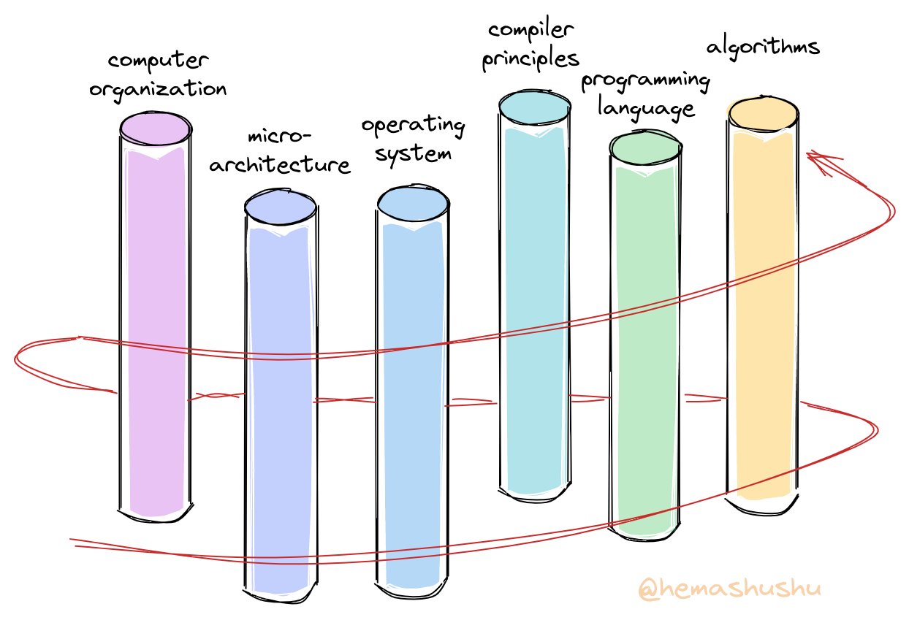
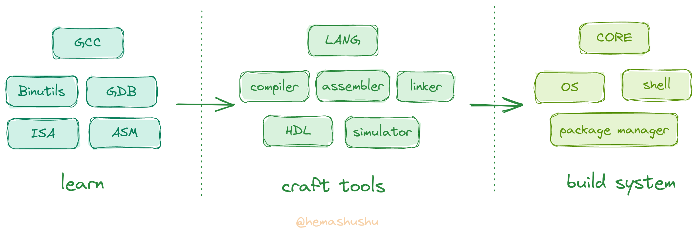

## Preface

RISC-V has become a popular computer instruction set in recent years, and many of you may have tried compiling the RISC-V version of the Linux kernel, following tutorials to write the RISC-V version toy operating systems, toy programming languages and compilers, or even toy CPU using the hardware description language (HDL).

Regardless of which path you chose, at the beginning, you were likely excited and eager, like a brave adventurer embarking on a new quest in an unknown world. However, as you progressed through the tutorial and reached the second chapter, you may have started to furrow your brow, grit your teeth, and struggled through a few more chapters before ultimately giving up. You may have thought, "I've been writing programs for several years, and I'm not even intimidated by various algorithm problems. Why can't I understand these tutorials?"

The root of the problem is a lack of complete understanding of computer system techology (also known as _computer fundamentals_, _low level techonlogy_, or _core technology_, collectively referred to as _system technology_ below).

You might argue, "System technology? I learned about that in computer fundamentals courses, and I passed the exams!" Indeed, computer science programs offer courses like _Computer Organization_, _Compiliation Principles_ and _Operating Systems_, which are often divided into multiple semesters to ensure you can understand. However, **learning these subjects separately is a mistake** because system technology is interconnected.

_The spiral learning path_

Computer systems consist of three major fundamental components: language, processor, and operating system. From afar, the processor and operating system may appear to be the same thing. Together, they build the most complex machine in human history -- the computer. The processor is responsible for implementing the invariant logical opeartions, while the operating system is a extension of the processor, responsible for implementing the variable parts. Language is used to express, encapsulate, and abstract the functionality of the machine, making communication between the machine and humans possible. They are different aspects of the same goal -- to make the machine solve problems.

Learning them separately will lead to a lack of understanding of the connections and reasons behind them. Imagine each of these subjects as a standing pillar. The better learning path is to **spiral gradually up** around these pillars, rather than climbing up one pillar, then sliding down and climbing another.

Secondly, there are also issues with the learning methods. Most system technology is the result of continuous problem-solving and accumulation by engineers. In other words, theory does not play a dominant role, they are more about the best practices through various attempts. Therefore, a better approach to learning should starting with exploration and experimentation, learning by practicing, making mistakes, and summarizing, rather than starting with a lot of theory.

Overall, although we may have learned almost all of the subjects related to system technology, we may not have truly mastered them because our learning process is far from the way the system is built and constructed. You can try designing the simplest instruction set without the help of the internet, then drawing the approximate data path of the microarchitecture by hand, or writing a boot loader for a given target hardware platform, or writing a simple syntax parser from scratch without any libraries. You will find that even though you have just learned these subjects, implementing them is very challenging.

## Characteristics

In fact, we have already accumulated some system technology in our daily study and work, but it is often fragmented and incomplete. I hope to connect them through a series of articles, so that they become truly knowledge and skills. This series has the following characteristics:

- It doesn't follow the traditional approach "learn theory first, then do projects". Instead, it starts with exploration and experimentation, interspersing theory in the process of practice. Also unlike many practical tutorials, this series not only shows you **how to do**, but also explains **why**. Many practical tutorials often ignore the latter point and list only the steps to follow, with screenshots and input parameters, or just show you a long operating videos. While following these tutorials may make it "work", the underlying principles are often vague. Additionally, such instructions are highly dependent on the environment and tools, and sometimes steps change subtly due to changes in software and hardware environments or tool version updates, making them inconsistent with the tutorial and ultimately unsuccessful.

- It doesn't divide the content by subject, but by multiple small stages according to the system construction process and our understanding level. Each stage will involve knowledge from multiple subjects.

- **It doesn't require any specified software or hardware**. Many professional system technology tutorials or training require various high-end and expensive proprietary software and hardware, this series only a few general open source and free software, and a few widely used and cheapest no more than hundred dollars   essential hardware modules are needed (of course, this series is free, and there will be no Ads or promotional links 😄). Besides saving money, the most important thing is that this series aims to enable you to create tools and build systems on your own, not to make you just an operator or user of a specific software or hardware.

- **It doesn't require any specified IDE, SDK, or library**. We will build everything from scratch, starting with a few general open source and free compilers and tools, and later using our own tools. By building our own tools, you can thoroughly understand every technical detail without leaving any blind spots.

- It's not popular science or superficial observation, but rather a truly in-depth practice of computer systems. Through this series you will gain a correct understanding of the system, and you will not be confused by various fancy "knowledge" that are widely circulated but actually wrong, e.g. the belief that the core technology of computers is only chip manufacturing, solving this problem and all problems are solved, which is completely wrong.

This series will use the RISC-V as the target architecture for learning and implementation. I chose RISC-V because:

- Its instruction set is relatively simple, which makes it possible for you to implement "the smallest working" compiler and processor by ourselves.

- There are a large number of related open source and free tools and documents that you can use to check and verify your work, which is very important for the exploration and learning process.

- Finally, if you produce a product, there is no need to worry about licensing issues.

## Summary

There is no doubt that system technology contains large amount of content. It represents the accumulation of the work of thousands of top engineers from around the world over several decades, and its breadth and depth are almost at the limit of what the human brain can comprehend. In fact, one could argue that it is the work of a group of people who have far surpassed our current era.

I realize that it is impossible to cover all of the content in just a few articles. That is why I have prepared four series, each consisting of several parts, and each part containing several chapters. In total, there will be about a hundred articles. The main focus of this series can be described in one sentence: **Learn about existing tools and systems, create you own tools, and build new systems.** You may have already read books or articles like "Building Systems from Scratch", but this series not only builds systems, but also makes tools for building systems, which I believe will still be refreshing for you 😁.

Although the content is vast, you do not have to worry about it is too difficult to complete. Each part, despite having a fancy name, only aims to achieve the level of "just enough to work". Moreover, every small component of system technology is surprisingly simple than you think when analyzed and implemented individually. So as long as you follow step-by-step, you will not get stuck along the way. Of course, I will also strike a balance between "rudimentary" and "practical" to ensure that each "work" in the series has its value.

> Sometimes the system technology itself is not really difficult, it is just that you have encountered a lousy tutorial or have not meet a good teacher. I found that although there are many excellent and classic textbooks, they are often overshadowed by a huge amount of low-quality information. Choosing the right textbook is crucial.

Mainstream modern system technology carries a heavy historical burden. For example, GCC has been around for more than thirty years as well, and the Linux kernel has been under development for thirty years as well. For beginner, it is difficult to comprehend, modify, and expand these systems, and many new concepts cannot be integrated. In contrast, our system is built from scratch, with no burden, making it relatively simple and easy to implement. Some stubborn problems can be solved fundamentally, and new concepts (which are not really new but just not well-known). The system we built has many highlights, for example:

- Use one language for hardware development, system level development, application and web frontend development.
- A user-friendly assembly language.
- A functional script language for both Shell script and linking script.
- A operating system that uses a microkernel, making it easy to develop, debug, install and deploy (develop driver programs just like regular programs). System updates do not require a reboot and can be rolled back.
- A system security model based on capabilities rather than users and groups.
- A Shell with structured data.

Of course, there are many other features, which will be detailed in spcific chapters.

## Like, Share and Donate

Although I have already put most of the content in this series into practice, I found it quite challenging to explain them. It was difficult to organize the vast and intertwined content, choose practice projects, achieve smooth transitions between chapters, ensure the knowledge is correct, and make it easy to understand for readers. It took me more than four months to writ just the first eight articles, revising them over and over again. I don't know how many years it will take me to finish the last chapter 😵‍💫.

On the other hand, while system technology is significant in terms of inheriting and innovating scientific and technological, and as the foundation of modern industry, it is not much value for individuals (💰), as most enterprises are engaged in application-level development. System technology is too distant for both ordinary people and developers.

Even though I do my best to write each article well, only a few readers will actually read them, and only an extremely small number of people will be interested. Therefore, if you happen to come across this series and find them helpful, please feel free to tip me, your a cup of cola or coffee is the driving force for my next article 😄.

Finally, Although system technology is "almost useless" for individuals, it can satisfy your primal curiosity, exploration, and creativity very well. Imagine what could be cooler than "conquering the most complex machine with your bare hands". When you finish the last chapter, I believe you will see a different world. Click on [the series index](../2022-11-01-building-a-modern-computer-system-from-scratch-index) to start your journey!



    


