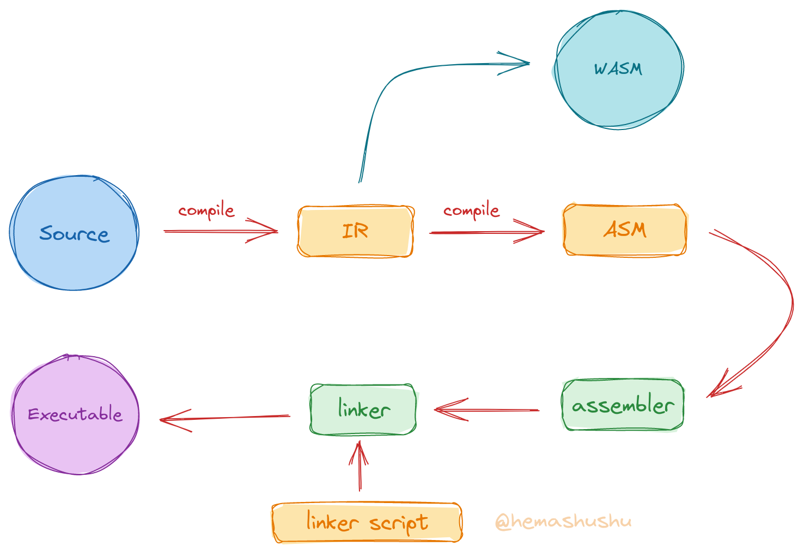

## Preface

RISC-V has been a popular computer instruction set for the last few years, and I'm sure many of you have already tried to compile a RISC-V version Linux kernel, or followed a tutorial to write a toy operating system, create a toy programming language, or even write a toy CPU in HDL (hardware description language).

At the beginning you must have been excited, like a hero starting a new adventure in an Isekai (_異世界_, otherworld). But when you get to the second chapter of the tutorial, you may start to feel confused and finally have to give up. You may be wondering: "I've been writing programs for years and solving all kinds of algorithm problems easily. Why don't I understand these tutorials?"

Obviously this is because of the lack of understanding of the _system technology_. You may disagree: "Well, system technology, I learned it long ago in my basic computer course and passed the exam! ". Yes, there are courses such as _Computer Organization and Design_, _Compilers Principles_, _Operating Systems_ etc., and of course they are studied in several semesters. However, it is a mistake to study these subjects separately, because the system technologies of computers are intertwined.

_The progressive learning path_

A computer system consists of three basic parts: _programming language_, _processor_, and _operating system_. If viewed from far away, the processor and the operating system are the same thing, they build together one of the most complex machines in history -- computers. The processor implements the constant logical and operations, the operating system is an extension of the processor and implements the parts that need to be changed, and the language is used to express, encapsulate and abstract the functions of the machine, making communication between the machine and humans possible. It can be seen that they are "the different aspects of the same purpose -- to let machines solve problems". Learning them separately is hard to understand the connections of them. Consider thinking of each subject as a pillar. The correct learning path is to stepping upward in a spiral around these pillars, instead of climbing one pillar, then sliding down and climbing another.

In addition, there are also problems with the learning way, as computer system technologies are mostly the result of engineers' continuous problem solving. In other words, the theory is not the main thing, these techniques are the _best practices_ derived through trial and error. Therefore, a better way to learn is to start with exploring and practice, and then summarize by trial and error, rather than learning a lot of principles, doing a lot of exercises.

In general, although you have almost all studied subjects related to computer systems, you have not really mastered these techniques because they are so far from how systems are built. Try designing a minimal instruction set and drawing the data path of a microarchitecture by hand without the help of the Internet, or writing a cold-boot bootloader for a target architecture, or writing a simple syntax parser from scratch without any libraries, and you will find it very difficult.

## Features

We have learned a lot of computer system knowledge in our normal work and study, only they are loose and incomplete in our mind, I want to connect these knowledge through a series of articles, so that you can master it. There are many features in this series:

- No more "talk about the principle first, then do some small projects", but start from exploration and practice, and then derive the principle in the process of practice. And unlike many hands-on tutorials, this series not only talks about "how to do", but also explains "why" for each step. Many hands-on tutorials tend to ignore the second point, they generally list each instruction and input parameters, you must follow the instructions carefully in order to finally succeed. Follow these tutorials although you can also make "works", but the principle of which is certainly very vague. And these operating guidelines are very dependent on the environment and tools, often because of changes in the hardware and software environment or updates to the version of the tool, resulting in some of these steps have subtle changes, inconsistent with the tutorial, and in the end can not be successful.

- No more learning by subject. The entire series is split into small stages based on the building process of the system. Each stage will cover multiple subjects at the same time, but each subject will not be covered in depth. You will complete one stage before moving on to the next.

- **Build from scratch without any specified IDE, SDK or library.** Only a few generic open source compilers and tools is need, and later you will use your own tools. Because even the tools are built by us, you can thoroughly figure out every detail.

- Does not rely on any specified software and hardware, using only a few general open source software and a few of the most widely used and low-cost hardware modules, that can be completed to the last chapter. While many professional system technology tutorials or training require a variety of expensive software and hardware, this series costs less than a hundred dollars in total (of course, the series is free and there will be no promotional links in the articles). The most important thing is that this series is not designed to make you an operator of some particular software or hardware, but to let you create your own tools and build the system.

- It is not a walk-through, but an in-depth and complete practice of computer systems. After completing this series, you will have a clear understanding of the system and can be free from all the trendy "knowledge".

This series will use the RISC-V instruction set as the target architecture for learning and implementation, the reasons for choosing RISC-V are.

- It's relatively a simple instruction set, which makes it possible to implement your own "minimal working" compiler and processor.

- There are a large number of relevant open source tools and documentation. Using tools to check and verify that your "work" is correct, which is important for both learning and implementing.

- Finally, if you make a product, you don't need to worry about the licensing issues.

## Introduction

The knowledge of computer systems is very large, it is the accumulation of thousands of the world's best engineers over the decades, both the width and depth of knowledge are almost close to the limits of the human brain. It can even be said that it is the work of a group of people who are "far beyond our current era". _Hemashushu_ certainly know that it is impossible to complete through a few articles. So I'm going to write four series, each series contains several parts, each part contains several of chapters, a total of about a hundred long articles 😅.

The main content of this series can be described in one sentence: **Learning existing tools and systems, making your own tools, building a new system**.

The topic is very large, but you don't have to worry about it is too difficult to achieve. Because in each part you will only get to the level that just works. What's more, each small part of the system technology is surprisingly easy to learn if you take it out separately. So just follow step by step and you won't get stuck in the process.

But I also balance "simplicity" and "practicality", so that each "small project" has its own value. Modern mainstream computer systems have heavy historical burden, for example, GCC is more than thirty years old, as well as the Linux kernel has been developed for thirty years, which makes it very difficult for the newcomer to read, understand, modify and expand, and many new ideas cannot be integrated. Our system, on the other hand, because it starts from scratch and has no burden at all, will be relatively simple and easy to implement, and some problems can be solved from the root, new ideas (which are not actually new, just because few people know about them) can be integrated without any worries. Some features:

- A language that can both be used for hardware, low-level, back-end and front-end development.
- An assembly language that is human-readable.
- A functional linker scripting language.
- A microkernel system in which drivers can be develop, debug, install and distribute as easy as general applications.
- A system that never needs to be shut down and reboot, with a rollbackable update mechanism.
- A security model based on capability rather than _user and group_.
- A _Shell_ with structured data.

There are more features that will be listed in specific chapters, but of course the main feature is that **you will make and use your own tools**. Even if you can see other books or articles like "Building System from Scratch", this series will still be a refreshing experience for you 😁.

## Like, Share, Donate

Although I have completed most of the projects in this series, I find it quite challenging to explain them. For example, how to organize the huge and intersecting contents, how to select the practical topics, how to make the transition between chapters, how to ensure the correctness of the contents, how to make it easier for the readers to read, and so on.

The first 8 articles in the first series took more than four months to complete, after repeated writing and revising. I don't know how many years it will take to finish the last chapter. On the other side, although computer system technology holds the importance of technology inheritance and innovation, and holds the basis of modern industry, but it is "realistically" almost useless (💰) for individuals, because almost all companies are engaged in application-level development, and the system technology is too far away from a typical developer.

Although I try hard to write every article, it is obvious that only a few people will read it, and only a very few of them will be interested. So, if you happen to read this series of articles and find it helpful, please donate to me without hesitation! Your donation of a cup of coffee is my motivation to write the next article. 😄



    



Finally, while systems technology is not realistically useful, it can be a good way to satisfy your "curiosity, exploration and creation". What could be cooler than "conquering the most complex machine in the history of mankind, alone and with bare hands"? When you finish the last chapter, I believe you will find a different world. Click on the title of the table of contents below to start your journey to the Isekai!

- - -

> **note** This list will be continuously updated

**Series 1: Dive into RISC-V system step by step**

- Part I: Understanding the usage of compiler, linker, debugger and some common binary tools, understanding the organization of program, building minimal freestanding (also called _bare metal programs_) executable programs.

  - [S01C01 What is cross-compilation? Let's cross-compile and run our first program](../2022-11-05-s01c01-cross-compile-and-run-the-first-program)
  - [S01C02 Write a Hello World program that can run alone without an OS](../2022-11-06-s01c02-write-a-program-run-alone-without-os)

- Part II: A brief look at the principles of interaction between software and hardware through microcontroller (MCU). Writing bare-metal program (firmware) without SDK or HAL (hardware abstraction library), directly reading and writing registers, controlling the electrical signal of input and output pin (GPIO), implementing serial communications.

- Part III: Understanding the principles of program loading, dynamic linking in modern systems, understanding the function call conventions of RISC-V and the basic instructions, writing simple programs in assembly language.

- Part IV: Design an assembly language with a target architecture of RISC-V, implement its assembler and syntax parser.

- Part V: Designing a functional linker script language and implementing a script interpreter.

**Series 2: Implementing a modern language and compiler step by step**

- Part I: Designing an IR (intermediate language) and implementing a code generator from IR to assembly language.

- Part II: Designing a modern statically typed language, implementing a code generator from high-level language to IR, now you have a _simple but complete compilation system_.

- Part III: Implement the [WASM](https://webassembly.org/) virtual machine (VM) and then implement the code generator for the IR to WASM. With the WASM VM you can get a basic idea of how a processor works, while having the WASM code generator means that the language can run in a browser.

- Part IV: Implementing the IR to the [LLVM IR](https://llvm.org/docs/LangRef.html) code generator, which allows the language to generate programs for `x86` and `arm` target architectures.

- Part V: Implementing the project construction tool and package manager, which is a necessary part of any modern language.

- Part VI: Rewriting the compiler in the language to achieve _self-hosting_ (i.e., the compiler can compile its own source code), and from now you start using your own tools to build the system.

**Series 3: Implementing a functional RISC-V CPU step by step**

- Part I: Designing a minimal instruction set that enables numeric accumulation and memory loading and storing, implement a minimal processor with digital circuit simulation software that contains the basic processor elements, such as ROM, RAM, register file, decoder, controller and ALU (arithmetic logic unit), which can execute the instruction set.

- Part II: Deriving an HDL language from the language, implement a digital circuit simulator and a test framework, implement a code generator from this HDL to [SystemVerilog](https://en.wikipedia.org/wiki/SystemVerilog). Re-implement the previous processor with the HDL and download it to the FPGA hardware for power-on testing.

- Part III: Implementing a multi-cycle RV64I processor using the HDL language and download it to the FPGA hardware for power-on testing.

- Part IV: Implementing some common protocols (e.g. UART, \(I^2C\), SPI), write drivers for common peripherals (e.g. GPIO, SPI Flash, SD card, SSD 1306 display etc.). Integrating into the processor to achieve a complete hardware system.

- Part V: Upgrade the microarchitecture of the processor to a multi-stage pipeline design.

**Series 4: Implementing a functional microkernel OS step by step**

- Part I: Adding a MMU (memory management unit) to the processor, as well as a privileged module.

- Part II: Implementing the minimal kernel, i.e. implementing basic serial text sending and receiving, page tables, memory management, program loader, process switch and message mechanisms.

- Part III: Implementing the most simplified _ext4_ like file system.

- Part IV: Implementing a simple _Shell_.

- Part V: Implementing a simple network interface.

- Part VI: Implementing a package manager.

- Part VII: Adding a floating point module to the processor, and a matrix algorithm coprocessor.

- Part VIII: implementing a simple machine learning library and then implementing a handwritten number recognition program.

- Part IX: Implementing a simple graphics acceleration coprocessor.

- Part X: Implementing a simple graphics library, and make a retro action game.
