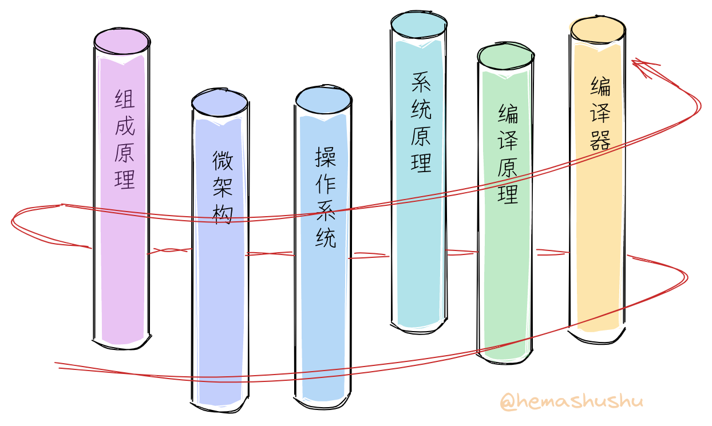
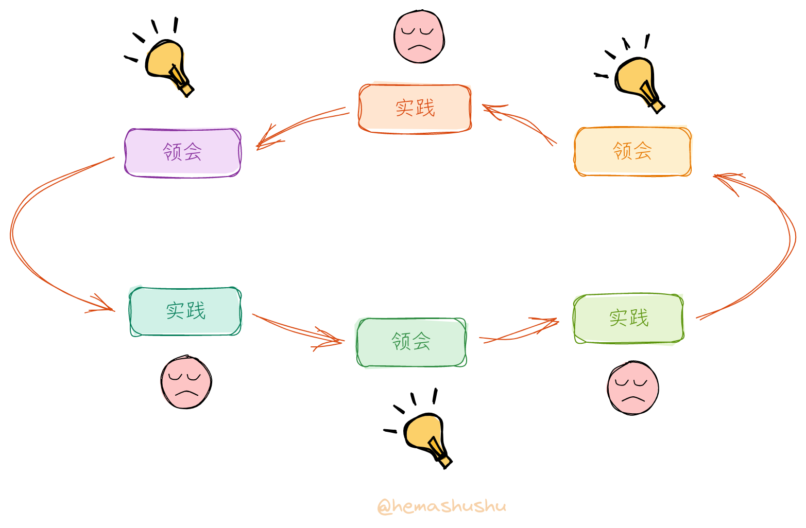
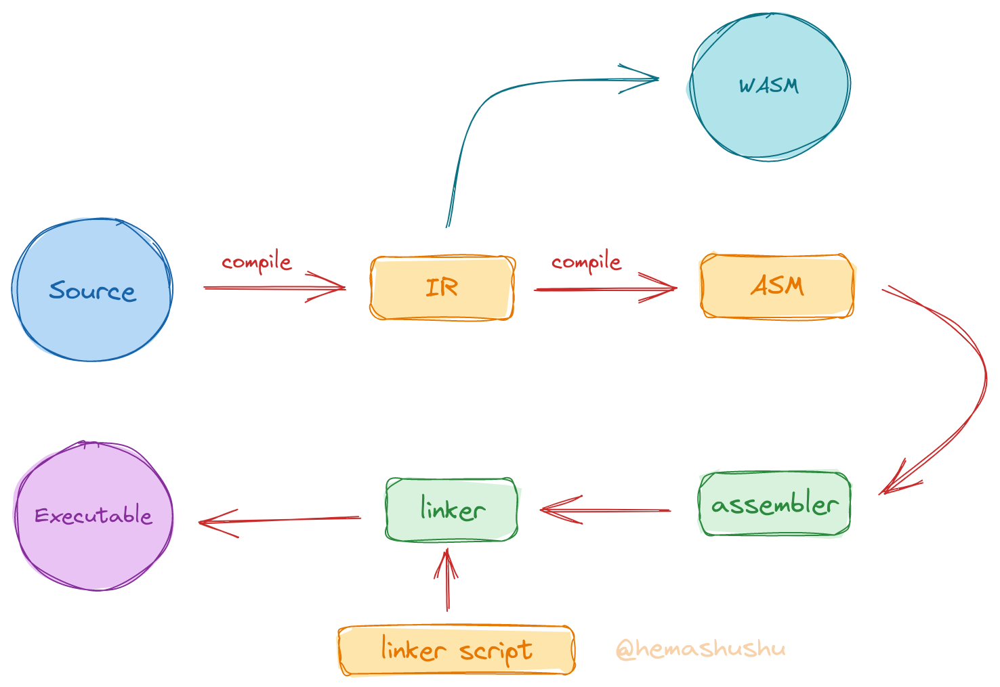
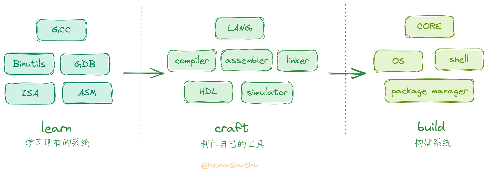

+++
title = "从零开始一步一步构建现代计算机系统 - 刨根问底的开始"
date = 2022-10-31T14:34:52+08:00
images = ["/posts/2022-10-31-building-a-modern-computer-system-from-scratch-step-by-step/images/mcu.jpg"]
tags = ["riscv", "scratch"]
categories = ["tutorial"]
draft = false
+++

<!--
# 从零开始一步一步构建现代计算机系统 - 刨根问底的开始
-->

## 前言

RISC-V 是最近几年热门的计算机指令集，相信已经有不少朋友已经尝试过编译 RISC-V 版的 Linux 内核，或者跟着教程编写玩具操作系统、制作玩具编程语言，甚至还有用 HDL（硬件描述语言）编写自己的玩具 CPU。

无论你是哪种，刚开始时肯定既激动又兴奋，就像要在一个异世界开始一段新冒险的勇者那样。不过翻到教程的第二章，可能大部分朋友就开始眉头紧锁，然后咬着牙又翻了几章，经过一番挣扎最后只能放弃。这时候你可能很疑惑：“明明写了几年的程序，各种算法题早已不放在眼里，怎么在这里就翻车了呢？！"

显然这是因为缺少对 _系统的底层技术_ 的了解（_系统的底层技术_ 也就是 _计算机基础技术_，不过这个名称经常引起理工科之外的人误解，下面简称 _系统技术_），你可能会反驳：”系统技术嘛，在计算机基础课程里我早就学过了，考试也通过了！“。是的，在计算机专业的课程设置里都有诸如 _组成原理_、_编译原理_、_操作系统_ 等课程，而且还担心你吸收不了于是一门一门地分几个学期教学。不过**把这些科目分开学习是错误的**，计算机的系统技术相互交叉。

_螺旋式的学习路径_

计算机系统包括了 _语言_、_处理器_ 和 _操作系统_ 三个基本组成部分。如果从远距离来看，处理器和操作系统是同一回事，它们共同构建了一种人类文明当中最复杂的机器 ———— 计算机。处理器负责实现不变的逻辑运算，操作系统是处理器的自然延伸，负责实现需要变化的部分，而语言用于表达、封装和抽象机器的功能，使得机器和人类之间的交流成为可能。可见计算机系统的基本组成部分是 **同一个目的 ———— 让机器解决问题** 的不同侧面，分开学习自然无法理解其中的联系和缘由。不妨把每一个领域想象成一根根立起来的柱子，正确的学习路径是围绕着这些柱子**螺旋式地逐渐往上爬**，而不是一口气爬完一根柱子，然后滑下来再爬另一根柱子。

其次学习方式也存在问题，计算机系统技术大部分是工程师们在不断地解决问题之后得出的总结和积累，也就是说，这些技术当中理论并不是占主导作用，更多是为了解决问题而通过各种尝试后得出的 _最佳实践_。因此较好的的学习方式应该是先从探索和实践开始入手，然后**边实践边试错、边领会边总结**，而不是先学一大堆原理，做完一堆习题，再来实践。

总的来说，虽然我们几乎都学过跟计算机系统相关的科目，但因为跟系统的构建方式和过程都相差甚远，所以实际上并没有真正掌握到这些技术。不妨试试在没有网络的帮助下，能否自己设计一套最简的指令集，然后手画微架构（microarchitecture）的大致数据通路（data path）；或者给定一个目标架构，编写一个冷启动的引导程序；又或者不依赖任何库，从零开始手写一个简单的语法解析器。

## 特点

实际上我们在平时的工作和学习当中已经积累了一定的系统知识，只是它们在脑海里或者是松散说着是游离的状态，我希望能通过一系列文章，把这些知识有序地连接起来，从而成为你掌握的技术。这系列文章有如下特点：

- 不再是 “讲原理然后做项目”，而是从探索和实践入手，在实践和试错过程中再穿插原理（为了给你解闷，有时还会穿插一些我知道的小典故小故事）。
- 不再根据学科分类，而是根据系统的构建过程以及我们能理解的程度，把整个系列切分为多个小阶段。每个小阶会同时涉及多个领域（学科）的知识，每个领域都是够用为止，不会过度深入，完成一个阶段再进入下一个阶段。
- **不需要任何专门的 IDE、工具、SDK 或者库**，从零开始构建。开始阶段只需几个通用的开源免费的编译器和工具，后面则使用自己的工具，因此可以彻底弄明白每一个技术细节（毕竟就连工具都是自己构建的）。
- 无需昂贵的软件和硬件，只使用几个通用的开源免费的软件，和几个最广泛使用的（久经考验的）最廉价的硬件模块，即可以完成到最后一章。很多专业的系统技术教程或者培训需要各种昂贵的高大上的专业软件和硬件，而我们这个系列只有硬件模块需要开销，而且一共只需一两百来块钱，最重要的是这个系列不是为了让你成为某个软件或者硬件的操作工和应用者，而是让你创造工具、构建系统。（为打消你的疑虑我先说明，这系列文章是免费的，文章当中也不会有任何广告或者推广链接）
- 不是科普或者走马观花式的观摩，而是深入地对计算机系统的完整实践。通过这一系列文章你会对系统有正确的认识和理解，可以不被那些广泛流传的实则错误的 “知识” 所迷惑（比如很多人认为计算机核心技术只有芯片制造机器，似乎解决这一项其它都不是问题，而事实上这是完全错误的，制造机器处于末端环节，跟系统真正的核心和源头相差十万八千里）。

这一系列文章会以 RISC-V 指令集作为学习和实现的目标架构，之所以选择 RISC-V 原因有：

- 它的指令集相对比较简单，这使得我们自己动手实现 "最小的能工作的" 汇编器及处理器成为可能；
- 有大量相关的开源免费的工具和文档，可以享用现有的工具来检查和验证我们的 "作品" 是否正确，这对摸索和学习过程非常重要；
- 最后如果我们做出了产品，也无需顾忌授权问题。

## 内容简介

无可否认计算机系统的内容非常之多，它是几十年以来成千上万全球最顶尖工程师的总结和积累，无论是知识面广度和深度都几乎逼近人脑的极限，从某个角度甚至可以说，它是一群思维**远超越我们当前时代**的人的作品。河马蜀黍知道无法简单地通过几篇文章就能讲完，所以准备了四个系列（series），每个系列分为若干部（part），每部含若干篇文章（chapter），一共也就百来篇长文。下面简单介绍一下：

1. _一步一步深入 RISC-V 系统_。这个系列分为五部：
   - 第一部：了解编译器、链接器、调试器以及一些常用二进制工具的使用方法，了解程序的组成，构建最小独立式可执行程序（freestanding，也叫 _裸机程序_）等；
   - 第二部：通过微控制器（MCU）来简单地了解软件和硬件之间的交互原理，通过不使用 SDK 或者硬件抽象库（HAL），而是直接读写寄存器的方式编写裸机程序（固件），控制电信号的输入输出（GPIO），实现串口通信等；
   - 第三部：了解现代系统的程序加载、动态链接的原理，了解 RISC-V 的函数调用规程以及基本指令，使用汇编语言编写简单的程序；
   - 第四部：设计一门目标架构为 RISC-V 的汇编语言，实现其汇编器，同时了解简单的语法解析器的原理；
   - 第五部：设计一门链接脚本语言，实现其链接器，同时了解脚本解析器的原理。

2. _一步一步实现一门现代语言及其编译器_。这个系列分六部：
   - 第一部：设计一门中间语言（IR），实现从中间语言到汇编语言的代码生成器（code generator）；
   - 第二部：设计一门现代的静态类型的语言，实现高级语言到中间语言的代码生成器，至此完成了一个 _简单的完整的编译系统_；

   
   _自己的编译系统_

   - 第三部：实现 [WASM](https://webassembly.org/) 虚拟机（VM），然后实现中间语言到 WASM 的代码生成器。实现 WASM VM 的同时可以大致地认识一个处理器是如何工作的，另一方面有了 WASM 代码生成器，意味着我们的语言能在浏览器中运行；
   - 第四部：实现中间语言到 [LLVM IR](https://llvm.org/docs/LangRef.html) 的代码生成器，让我们的语言能生成目标架构为 `x86` 和 `arm` 的程序。
   - 第五部：实现项目构建器及包管理器，这是任何现代语言都必备的。
   - 第六部：用当前语言重写编译器，实现语言自托管（self-hosting），即编译器可以编译自己的源代码，从此我们开始使用自己的工具来构建系统。

3. _一步一步实现一个实用型的 RISC-V CPU_。这个系列分五部：
   - 第一部：设计一个最小的指令集，实现数字累加和内存加载和存储功能；然后通过数字电路仿真软件实现一个最简处理器，该处理器包含了 ROM、RAM、寄存器堆（register file）、译码器、控制器及算术逻辑单元（ALU）等基本处理器要素，能执行我们的指令集。通过这一部来了解处理器的基本运作原理，以及软件如何变成电信号。
   - 第二部：从我们的语言派生出一门 HDL 语言，实现该门语言的数字逻辑电路模拟器以及测试（验证）框架；实现从这门语言到 [SystemVerilog](https://en.wikipedia.org/wiki/SystemVerilog) 的代码生成器，然后用这门语言重新实现上一部的基础组件以及处理器，并下载到 FPGA 硬件上通电测试；
   - 第三部：使用自己的 HDL 语言实现一个多时钟周期的 RV64I 处理器，并下载到 FPGA 硬件上通电测试；
   - 第四部：实现常见的通信协议（比如 UART、$I^2C$、SPI），书写常见的外设（比如 GPIO 接口、SPI Flash、SD 卡、SSD 1306 显示屏等）的驱动。整合我们的处理器，实现一个完整的硬件系统；
   - 第五部：将处理器微架构升级为多级流水线设计。

4. _一步一步实现一个实用的微内核操作系统_。这个系列分六部：
   - 第一部：为我们的处理器添加内存管理单元（MMU）以及特权相关的模块；
   - 第二部：实现最小的内核，即实现基本的串口输入输出，多级页表，内存管理，程序的加载及进程的简单分时切换，以及消息机制等；
   - 第三部：实现简化版的 `ext4` 文件系统；
   - 第四部：实现简单的用户交互界面（shell）以及一个包管理器；
   - 第五部：实现一个简单的图形加速协处理器（coprocessor）；
   - 第六部：实现一个简单的图形库，实现一个复古风格的横向卷轴动作游戏。

一句话描述这一系列文章的主要内容就是：**学习现有的工具和系统 -> 制作自己的工具 -> 打造新的系统**。

其中的内容非常多，不过你不用担心难度过高而无法完成，因为每一个部分虽然名堂很大，但都是仅实现最基本的程度，也就是 "刚好能用" 的程度即止，所以只需一步步跟着来，就不会发生在中途就被卡住的情况。不过我也会在 “简陋” 和 “实用” 之间平衡，让每一部的 “作品” 都有有实用价值。

现代主流的计算机系统都有沉重的历史包袱，比如 GCC 已有三十多年的历史，Linux 内核也修修补补三十年，导致无论是阅读理解、修改、扩充都非常繁杂，而且很多新观念无法整合。而我们的系统因为是从零开始，完全没有包袱，所以实现起来相对会简单轻松，有些问题也可以 **从根本上解决**（比如内存安全问题，从指令到操作系统到编译器一起配合即能在兼顾性能和安全的前提下解决）；新理念（严格来说并不是新的，只是因为没有融入现有系统而鲜有人认识）也能无所顾忌地加入，比如可以使用同一门语言实现硬件开发、底层开发、后端开发和前端开发；设计一门阅读友好的汇编语言；设计一门描述型的链接脚本语言；使用微内核，驱动能像普通程序一样开发、调试和安装；系统永不需关机和重启，可回滚的更新；系统基于能力（capability）而不是 _用户和组_ 的安全模型等等。

所以这套系统有相当多的特点和优点，即使你能看到类似 “从零开始构建系统” 的书籍或文章，我们这个系列仍让你耳目一新 😁。

## 点赞、转发、打赏

虽然这系列文章的大部分内容我都已经实践过，不过我发现要把它们从头到尾讲解起来相当有挑战性：庞大而交叉的内容如何组织才能做到由易到难，如何挑选实践的内容，如何做到篇章之间内容的自然过渡和衔接，如何确保内容的准确，如何保证读者看得明白不卡顿等等，单单第一个系列的前两部共 8 篇文章，前前后后反复琢磨和修改，居然用了四个多月的时间。我不知道要几年时间才能把最后一章写完。

而另一方面，虽然从宏观上来说计算机系统技术承载着科学技术的传承和创新，承载者现代工业的基础等重要意义，但对于个人来说，却很 "现实地" 几乎没有任何用处（💰），毕竟几乎所有企业都从事应用层面的开发，系统技术无论是对普通人还是对开发人员都太过遥远了。虽然作者很努力地想写好每一篇文章，但阅读的人显然是寥寥可数的，这是极其少数人才会感兴趣的内容。因此，如果你碰巧看到这一系列文章，如果觉得有收获，请毫不犹豫地打赏作者吧 😄！你的一瓶可乐一杯冰红茶的打赏就是下一篇文章的写作动力 😭。



    



最后，虽然系统技术没有现实上的用处，但它可以很好地满足人类原始的 “好奇、探索、创造” 的本能。试想一下，还有什么比 “独自一人徒手征服人类文明史上最复杂的机器” 更酷的事情呢？！当你完成最后一章时，相信会看到一个不同的世界。点击下面的目录标题开始异世界之旅吧！

- - -

## 目录

**系列 1: 一步一步深入 RISC-V 系统**

_Part 1_

- [S01C01 RISC-V GCC 快速入门](risc-v-gcc-quick-start/)
- [S01C02 构建最小的 RISC-V 程序](build-minimal-risc-v-program/)
- [S01C03 QEMU 模拟器及程序的调试](qemu-and-debug/)

_Part 2_

- [S01C04 XX](xx/)

更新中...

**系列 2: 一步一步实现一门现代语言及其编译器**

待更新

**系列 3: 一步一步实现一个实用型的 RISC-V CPU**

待更新

**系列 4: 一步一步实现一个实用的微内核操作系统**

待更新