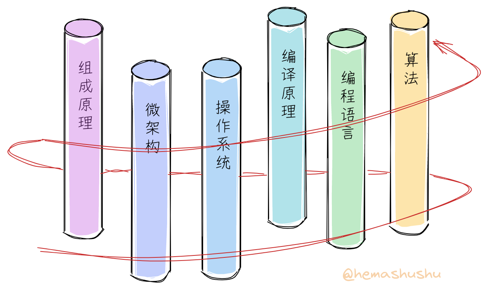
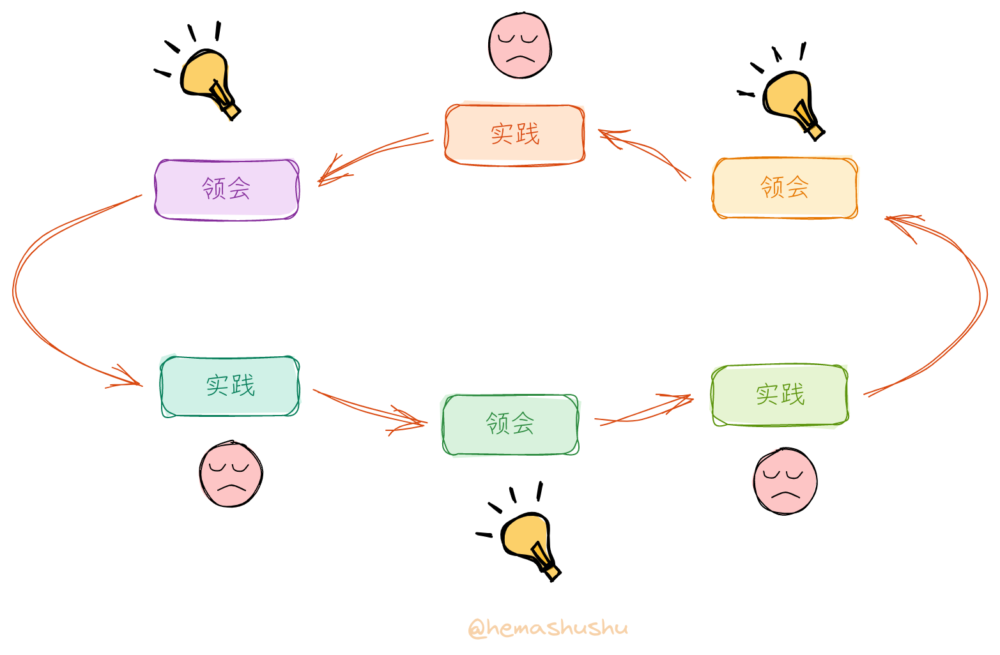
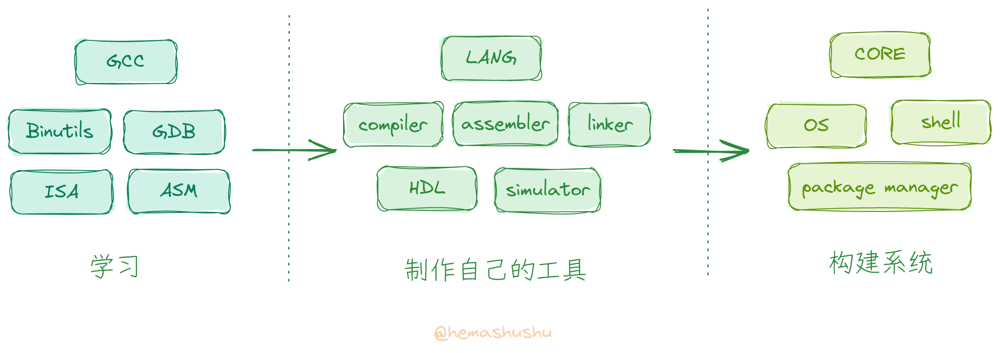

## 前言

RISC-V 是最近几年热门的计算机指令集，相信已经有不少朋友已经尝试过编译 RISC-V 版的 Linux 内核，或者跟着教程编写 RISC-V 版的玩具操作系统、玩具编程语言和编译器，甚至用 HDL（硬件描述语言）编写自己的玩具 RISC-V CPU。

无论是哪种，刚开始时你肯定既激动又兴奋，就像要在一个异世界开始一段新冒险的勇者那样。不过当你翻到教程的第二章，你可能就开始眉头紧锁，然后咬着牙又翻了几章，经过一番挣扎最后只能放弃。这时候你可能很疑惑：“明明写了几年的程序，各种算法题早已不放在眼里，为什么还是看不懂这些教程呢？！"

显然这是因为缺少对完整的 _系统技术_（有时也叫 _计算机基础_，_底层技术_ 或者 _核心技术_，下面统一称为 _系统技术_）的了解，你可能会反驳：”系统技术嘛，在计算机基础课程里我早就学过了，考试也通过了！“。是的，在计算机专业的课程里都设置有诸如 _组成原理_、_编译原理_、_操作系统_ 等课程，还因担心你一下子吸收不了而一门一门地分好几个学期教学。不过**把这些科目分开学习是错误的**，因为系统技术是相互交叉的。

_螺旋式的学习路径_

计算机系统包括了 _语言_、_处理器_ 和 _操作系统_ 三个基本组成部分。如果从远距离来看，处理器和操作系统会是同一回事，它们共同构建了一种人类历史上最复杂的机器 ———— 计算机。处理器负责实现不变的逻辑运算，而操作系统则是处理器的自然延伸，负责实现需要变化的部分。至于语言则用于表达、封装和抽象机器的功能，使得机器和人类之间的交流成为可能。可见它们是同一个目的 ———— 让机器解决问题的不同侧面，分开学习自然无法理解其中的联系和缘由。不妨把每一个领域想象成一根根立起来的柱子，正确的学习路径是围绕着这些柱子**螺旋式地逐渐地往上爬**，而不是一口气爬完一根柱子，然后滑下来再爬另一根柱子。

其次学习方法也存在问题，系统技术大多是工程师们在不断地解决问题之后得出的经验总结及其知识积累，也就是说，理论并不是起主导作用，更多是通过各种尝试后得出的 _最佳实践_。因此较好的的学习方法应该是先从探索和尝试开始入手，然后**边实践边试错、边领会边总结**，而不是先学一大堆原理，再做完一堆习题，最后才开始实践。

总的来说，虽然我们几乎都学过跟系统技术相关的科目，但因为我们的学习过程跟系统的构建方式和过程都相差甚远，所以实际上并没有真正掌握到这些技术。不妨试试在没有网络的帮助下，看看能否自己设计一套最简的指令集，然后动手画画微架构（microarchitecture）的大致数据通路（data path）；或者给定一个目标硬件平台，编写一个冷启动的引导程序；又或者不依赖任何库，从零开始手写一个简单的语法解析器。你会发现即使这些内容都是刚刚学完的但实现起来却很困难。

## 项目

实际上我们在平时的学习和工作当中已经积累了一定的系统知识，只是它们是松散的或者不完整的。所以我创建了一个名为 “从零开始一步一步制作自己的工具、构建现代计算机系统” 的项目，希望通过这个项目你能够把系统技术相关的知识连接起来，从而真正掌握它们。

这个项目由一系列文章组成，这些文章有如下特点：

- 不再是 “先讲原理然后做项目”，而是从探索和尝试入手，在实践和试错过程中再穿插原理（有时我还会穿插一些小典故）。而且跟很多实践型教程不一样，这系列不单单讲 **如何做**，还会讲解 **为什么要这样做**。很多实践型教程往往忽视了第二点，它们一般是哗啦啦地把每个操作步骤、包括屏幕截图和输入的每个参数等罗列出来，或者给你看一段很长配上旁白的操作过程视频，你必须严格跟着指引一步一步走才能最后成功。虽然跟着这些教程你也能做出 “作品”，不过对其中的缘由你肯定非常模糊。而且这些操作指引对环境和工具非常依赖，常常因为软硬件环境的变化或者工具的版本的更新，导致其中某些步骤有细微变化而跟教程不一致，最后无法成功。

- 不再分学科，而是根据系统的构建过程以及我们能理解的程度，把整个系列切分为多个小阶段，每个小阶都会同时涉及多个学科的知识。

- **不需要任何专门的软件和硬件**，很多专业的系统技术教程或者培训需要各种高大上的昂贵的专业软件和硬件，而这个系列只使用几个通用的开源免费的软件，和几个最广泛使用的最廉价的不超过一两百元的必要硬件模块，即可以完成到最后一章。（当然这系列的文章是免费的，文章当中也不会有任何广告或者推广链接 😄）。除了节省金钱，最重要的是这个系列不是为了让你成为某个软件或者硬件的操作工和使用者，而是让你自己创造工具构建系统。

- **不需要任何专门的 IDE、SDK 或者库**，全部从零开始构建。开始阶段只需几个通用的开源免费的编译器和工具，后面则会使用自己的工具。因为连工具都是自己构建的，因此可以彻底弄明白每一个技术细节而不会留有死角。

- 不是科普，不是走马观花式的观摩，而是真正深入地对计算机系统的完整实践。通过这一系列文章，你会对系统有正确的认识和理解，可以不被那些流传广泛而实则错误的各种时髦 “知识” 所迷惑。

这一系列文章会以 RISC-V 作为学习和实现的目标架构，之所以选择 RISC-V 原因有：

- 它的指令集相对比较简单，这使得我们自己动手实现 "最小的能工作的" 编译器及处理器成为可能；
- 有大量相关的开源免费的工具和文档，可以享用现有的工具来检查和验证我们的 "作品" 是否正确，这对摸索和学习过程非常重要；
- 最后如果我们做出了产品，也无需顾虑授权问题。

## 内容概况

无可否认系统技术的内容非常之多，它是几十年以来成千上万个全球最顶尖工程师的总结和积累，无论是广度还是深度都几乎逼近人脑的极限，甚至可以说它是远超越我们当前时代的一群人的作品。河马蜀黍知道无法简单地通过几篇文章就能讲完，所以这个项目分为四个系列（series），每个系列分为若干部（part），每部含若干篇文章（chapter）。好吧，一共也就百来篇长文。用一句话描述这一系列文章的主要内容就是：**学习现有的工具和系统，制作自己的工具，打造新的系统**。你可能已经阅读过类似 “从零开始构建系统” 的书籍或文章，不过当前这个系列不但要构建系统，还会制作构建系统的工具，相信仍会让你感到耳目一新 😁。

虽然内容非常多，不过你不用担心难度过高而无法完成，因为每一个部分虽然名堂很大，但都是仅实现 "刚好能用" 的程度即止。最主要的是，系统技术的每一个小环节只要单独拿出来分析和实践都会出乎意料地简单，所以只需一步步跟着来，就不会发生在中途就被卡住的情况。当然我也会在 “简陋” 和 “实用” 之间平衡，让每一个 “作品” 都有实用价值。

> 有时并不是系统技术本身真的很难，而是你遇到了糟糕的教材，或者没有遇到好老师。我发现编写优秀的经典的教材虽然不少，而且也很容易获得，只是往往会被巨量而劣质的信息所掩盖。选择对的教材很重要。

现代主流的系统技术都有沉重的历史包袱，比如 GCC 已有三十多年的历史，Linux 内核也持续开发三十年，对于新手来说，无论是阅读理解、修改、扩充都非常困难，而且很多新观念无法整合。而我们的系统因为是从零开始，完全没有包袱，所以实现起来相对会简单轻松，有些顽固问题也可以从根本上解决；新理念（严格来说并不是新的，只是鲜有人知而已）也能无所顾忌地加入，比如：

- 一门语言可以同时用于硬件开发、底层开发、应用开发和前端开发；
- 一门阅读友好的汇编语言；
- 一门函数型的脚本语言，既可作为 Shell 脚本，也可作为链接脚本；
- 一个使用微内核的系统，方便开发、调试、安装和发布（驱动程序也能像普通程序一样轻松开发），系统更新无需重启且可回滚；
- 基于能力（capability）而不是 _用户和组_ 的系统安全模型；
- 数据结构化的 Shell；

当然还有很多特性，在具体章节里会再详细列举。

## 点赞、转发、打赏

虽然这个项目的大部分内容我都已经实践过，不过我发现要把它们从头到尾讲解起来相当有挑战性：庞大而交叉的内容如何组织，如何挑选实践的内容，如何做到篇章之间的自然过渡和衔接，如何确保知识的准确，如何让读者看得轻松有趣等等，单单第一个系列的前 8 篇文章，经过反复琢磨和修改，前后居然花了四个多月的时间。我不知道还要多少时间才能把最后一章写完 😵‍💫。

而另一方面，虽然从宏观上来说系统技术承载着科学技术的传承和创新等重任，也是现代工业的基础，但对于个人来说，却很 "现实地" 没有多少用处（💰），毕竟几乎所有企业都从事应用层面的开发，系统技术无论是对普通人还是对开发人员都太过遥远了。

虽然我会努力地写好每一篇文章，但显然，阅读的人肯定是寥寥可数的，这其中又只有极其少数人才会感兴趣。因此，如果你碰巧看到这一系列文章，如果觉得有收获，请毫不犹豫地打赏我吧！你的一瓶可乐一杯咖啡的打赏就是我下一篇文章的写作动力啦 😄。

最后，虽然系统技术 "几乎没用"，但它却能可以很好地满足你的 “好奇、探索，创造” 原始天性。试想一下，还有什么比 “独自一人徒手征服人类史上最复杂的机器” 更酷的事情呢？！当你完成最后一章时，相信会看到一个不同的世界。点击 [文章目录](../2022-11-01-building-a-modern-computer-system-from-scratch-index) 开始异世界之旅吧！



    

