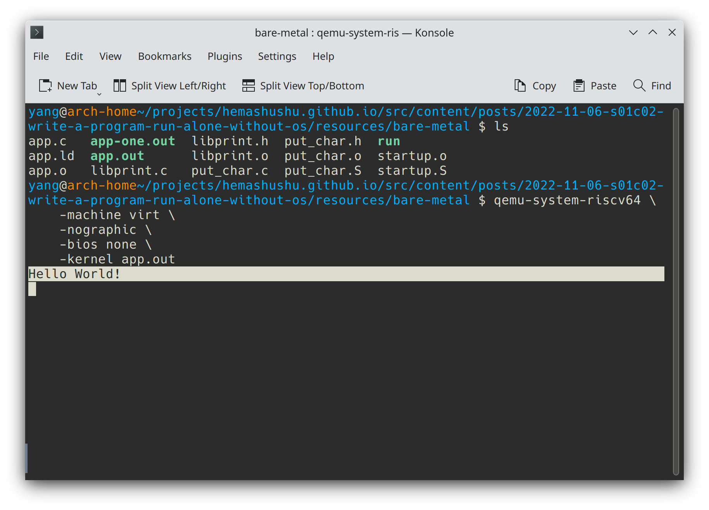

[上一章](../2022-11-05-s01c01-cross-compile-and-run-the-first-program) 我们写了一个 "Hello, World!" 程序，然后用 GCC 交叉编译并使用 QEMU 模拟器成功运行。不过我们也发现程序的体积有几百KB，里面肯定有很多不是我们自己写的内容，而且它还依赖操作系统才能运行。这一章将会编写一个无需操作系统、无需任何库，即可独自运行的 "Hello, World!" 程序（这种程序叫 _裸机程序_），然后同样会使用 GCC 交叉编译并尝试使用 QEMU 运行。通过裸机程序，我们可以了解一个完整的程序是如何组成的，同时还会了解机器通电后如何执行程序。

<!-- @import "[TOC]" {cmd="toc" depthFrom=2 depthTo=6 orderedList=false} -->

<!-- code_chunk_output -->

- [什么是裸机程序？](#什么是裸机程序)
- [如何启动裸机程序](#如何启动裸机程序)
- [裸机版的 "Hello, World!" 程序](#裸机版的-hello-world-程序)
  - [如何直接访问硬件？](#如何直接访问硬件)
  - [通过串口发送字符](#通过串口发送字符)
  - [实现 print_string 函数](#实现-print_string-函数)
  - [主程序](#主程序)
  - [程序启动器](#程序启动器)
- [编译](#编译)
- [链接](#链接)
- [运行](#运行)
- [打包静态库](#打包静态库)
- [总结](#总结)

<!-- /code_chunk_output -->

## 什么是裸机程序？

_裸机程序_ 是指在 "无操作系统" 的环境中运行的程序，初一听起来可能会觉得很神奇：“一个机器不用安装操作系统也能运行程序？没有操作系统我怎样输入程序的名称，怎样启动程序？” 但仔细想想，操作系统本身，还有系统引导器（比如 [GRUB](https://www.gnu.org/software/grub/)），它们都是在没有操作系统的情况下运行的。

其实裸机程序跟普通应用程序并没有太大的区别，其中的数值计算、流程控制、程序的结构等等跟普通应用程序是一样的，只是在进行一些特权或者 I/O 操作时，无法让操作系统代劳（因为运行环境中根本没有操作系统）,裸机程序需要自己直接跟硬件打交道。而一般的程序进行 I/O 操作时，是通过调用标准库，标准库再向操作系统发起 _系统调用_ 等一系列过程实现的。除此之外，裸机程序并不是通过文件名启动的，因为运行环境里根本没有文件系统，裸机程序通常以二进制形式存在于 ROM 或者磁盘的固定位置。

如果你想在裸机程序里让机器播放音乐或者访问互联网，则还得自己写声卡和网卡的硬件驱动（当然如果这些外设有开源的驱动的话就不必自己重头写）及其应用程序；如果想让机器能够一边播放音乐一边上网，那么还得写进程管理程序；如果想保存音乐文件到硬盘或者 SSD 里，则还得写文件系统；如果想让程序运行起来安全可靠一些，可能还得实现虚拟内存管理器。可见当你要求的功能越多，裸机程序就越接近一个操作系统，操作系统内核就是一个典型的裸机程序。当然如果你只是想让机器做一些很简单的事情，裸机程序也可以极其简单，比如下面要写的 "Hello, World!" 程序。

另外在微控制器（MCU）里运行的程序（通常称为 _固件_，_firmware_）也是裸机程序，因为微控制器的资源很少，没法运行一个操作系统，因此程序是独自运行的。（有一种程序叫 _实时操作系统_，_RTOS_，通常是以库的形式存在，跟通常概念里的操作系统不同）

## 如何启动裸机程序

机器通电之后 CPU 会从某个固定的内存地址开始执行第一条指令，这个内存地址一般对应着一段固定在 ROM 芯片里的 _加载程序_（_loader_）或硬件初始化程序（比如 BIOS），然后加载程序会尝试从约定的几个地方加载 _引导程序_（_boot loader_）并跳转到该引导程序的第一条指令（简称 _入口_），引导程序再加载 _内核_ 并跳转到内核的入口。

需要注意的是并不是每一台机器通电后的过程都一样的，有些硬件平台可能只有其中的一个或两个步骤，有些则可能会有更多的步骤。但有一点是确定的：每个程序的位置和入口都是上一个环节约定的，所以要让机器运行我们写的裸机程序，只需把这个程序放置在预留给 _引导程序_ 或者 _内核_ 的位置，这样就可以 "冒充" 为引导程序或者内核，机器通电后经过若干个步骤就会执行我们的程序。

## 裸机版的 "Hello, World!" 程序

下面要实现是一个 "裸机" 版的 "Hello, World!" 程序，该程序将会在 _QEMU 全系统模式_ 的 _RISC-V 64_ 机器（也就是程序 `qemu-system-riscv64`）里运行。

### 如何直接访问硬件？

传统的 "Hello, World!" 的程序很简单，主要就是调用 `printf` 函数向屏幕输出 "Hello, World!" 字符串。可是现在因为机器里没有操作系统，没法使用底层的 `write` _系统调用_（_syscall_），当然也无法直接调用 `printf` 函数。为了向屏幕输出文字信息，只能硬着头皮直接跟硬件打交道了。

幸好跟硬件打交道并不算太复杂，硬件主要就是数字电路，你可以粗略地把它看作由一系列 "小开关" 构成的电路。其中有些开关供外部设置，有些开关用于向外部反映状态。这些开关实际上对应着数字电路中的 _寄存器_ 元件（注意这里的寄存器不是指处理器里面那组寄存器，而是一般数字电路当中的寄存器），这些寄存器的输入端或者输出端会通过复用器映射到内存空间的某个地址。于是当我们向这些内存地址写入比特 0 或者 1 时，就可以设置相应寄存器的状态（即低电平和高电平，分别用 0 和 1 表示），反之，读取这些内存地址，就能获得相应寄存器的状态。于是跟硬件打交道就简化为 **向指定内存地址写入或者读取数字**。

### 通过串口发送字符

虚拟机 _QEMU RISC-V 64 Virt_ 里有一个虚拟的硬件 [NS16550](https://www.qemu.org/docs/master/system/riscv/virt.html)，它是一个实现了 [UART 通信协议](https://en.wikipedia.org/wiki/Universal_asynchronous_receiver-transmitter) （也就是我们常说的串口通信）的芯片。当向这个芯片读入数据时，数据会通过 RS-232 接口和电缆传送到另一端的设备，在 _QEMU RISC-V 64 Virt_ 里，这个 _另一端的设备_ 就是运行 QEMU 程序的虚拟终端。

通过阅读 [NS16550 的数据手册（data sheet）](http://caro.su/msx/ocm_de1/16550.pdf) 可知芯片一共有 13 个寄存器，这些寄存器用于控制硬件的工作参数，以及读取或写入通信数据。每个寄存器根据其作用一般都有一个名称，比如 NS16550 的第一个寄存器叫做 `THR`（Transmitter Holding
Register），从名称可以大概知道它是用于存放待发送的数据。同时，每个寄存器都有其数据大小，在 NS16550 里每个寄存器大小刚好都是 8 bit，所有寄存器排列在一起将会形成一段数据空间，从数据手册里可知 NS16550 寄存器形成了一个 8 bytes 的数据空间。这样我们就可以用 _地址_ 来定位寄存器了。寄存器的地址也叫 _偏移地址_。

> NS16550 的寄存器空间之所以不是 13 * 1 byte = 13 bytes 的空间，是因为部分寄存器共享了同一个位置。比如 `RHR` 和 `THR` 的地址都是 0。

然后再通过 [QEMU RISC-V virt 的源代码](https://github.com/qemu/qemu/blob/master/hw/riscv/virt.c) 所显示的硬件外设（peripherals）的内存映射地址列表，得知 UART 被映射到内存 `0x10000000` 位置。

```c
static const MemMapEntry virt_memmap[] = {
    ...
    [VIRT_MROM] =         {     0x1000,        0xf000 },
    [VIRT_UART0] =        { 0x10000000,         0x100 },
    [VIRT_FLASH] =        { 0x20000000,     0x4000000 },
    [VIRT_DRAM] =         { 0x80000000,           0x0 },
    ...
};
```

也就是说，NS16550 芯片的寄存器组的在内存中的基址为 `0x10000000`，那么寄存器 `THR` 的实际地址就是 `0x10000000` + `0`，寄存器 `LSR`（Line Status Register）的实际地址为 `0x10000000` + `0x5`：

综合以上信息，如果要向串口发送一个字符，只需向地址 `0x1000_0000` 写入字符对应的 ASCII 数值（一个 uint8 类型整数），然后这个字符就会被重定向到正在运行 QEMU 程序的虚拟终端。

所以要实现打印单个字符的函数是很简单的，在任意目录新建一个名为 `bare-metal` 的目录，然后创建名为 `put_char.S` 的文件, 内容如下：

```S
.equ VIRT_UART0, 0x10000000

.section .text.put_char

.globl put_char

put_char:
    li s1, VIRT_UART0
    mv s2, a0
    sb s2, 0(s1)
    ret
```

> 源代码可以到 [文章的 Github 源代码仓库](https://github.com/hemashushu/hemashushu.github.io/tree/main/src/content/posts) 下载。

上面汇编源代码定义了一个名为 `put_char` 的函数，其中的代码的大致作用如下：

1. `.equ VIRT_UART0, 0x10000000` 定义了一个名字为 `VIRT_UART0` 的常量；
2. `put_char:` 定义了一个名字为 `put_char` 的 _标签_，所谓 _标签_ 就是一个内存地址，因为函数通常由一个标签开始，并且由 `.globl` 指令导出，导出之后叫 _导出符号_，所以表示函数开始的标签也可以简单称为 _符号_。除了函数名称，符号还可以是全局变量、静态变量等的名称；
3. `li s1, VIRT_UART0` 将常量 `VIRT_UART0` 的值加载进寄存器 `s1`；
4. `mv s2, a0` 将寄存器 `a0` 的值，也就是函数的第一个参数的值，复制到寄存器 `s2`；
5. 将 `s2` 的值写到内存地址 `s1 + 0`，简单来说，上面 3 句的作用就是把第一个参数的值写到内存 `0x10000000`；
6. `ret` 返回到函数调用者，
7. `.globl put_char` 导出符号 `put_char`，导出的符号用于供外部使用。

> RISC-V 汇编的内容会在后面的章节陆陆续续出现，在这里只需知道大概的作用即可。对于这里没有说明的语句，会在后面的章节讲解。
>
> 如果你之前了解过汇编，会发现 RISC-V 的 [汇编源代码的语法](https://en.wikipedia.org/wiki/X86_assembly_language#Syntax) 是 Intel 风格，而不是 GNU 默认采用的 AT&T 风格，包括后面将会接触的 ARM thumb 汇编，也是 Intel 风格。

`put_char` 函数也可以用 C 语言实现，两个版本随意选一个即可。新建名为 `put_char.c` 的文件，其内容如下：

```c
#define VIRT_UART0 0x10000000

volatile char *const VIRT_UART0_PTR = (char *)VIRT_UART0;

void put_char(char c)
{
    *VIRT_UART0_PTR = c;
}
```

上面是一段很普通的 C 语言代码，其中关键字 `volatile` 可能比较陌生。关键字 `volatile` 用于标记变量的值可能会在程序之外被改变，通常情况是该变量的值来自内存某个地址，加了这个关键字之后可以防止编译器对它进行优化。

比如在源代码里有 **连续多次读取** 同一个变量的语句，如果没有标记为 `volatile`，编译器会把它优化为 **只读取一次**。因为显而易见后面的几次读取都是同样的值，所以生成汇编时只会生成 "从内存读取" 的指令一次。如果这语句用于读取 UART 的接收到的字符，那么就会出错，因为这个变量的值会在程序外部被改变的。这时就必须为变量加上 `volatile` 关键字，让编译器不要对它进行优化，而是原原本本地生成多条 "从内存读取" 的指令。

> 为了简单起见，这里忽略了 UART 发送所需的延迟。如果是在真实硬件上编写发送字符的程序，应该检查 UART TX FIFO 的值，仅当上一个字符发送完毕之后（即 TX 空闲之后）再发送下一个字符。完整的发送/接收代码可以参考这个文件 [ns16550a.c](https://github.com/michaeljclark/riscv-probe/blob/master/libfemto/drivers/ns16550a.c)

### 实现 print_string 函数

在函数 `put_char` 基础之上，可以实现打印字符串函数 `print_string`。新建名为 `libprint.c` 的文件，其内容如下：

```c
#include "put_char.h"

void print_string(const char *str)
{
    while (*str != '\0')
    {
        put_char(*str);
        str++;
    }
}
```

### 主程序

主程序很简单，新建名为 `app.c` 的文件，其内容如下：

```c
#include "libprint.h"

void bare_main()
{
    print_string("Hello, World!\n");
}
```

因为这个是裸机程序，为了跟标准程序区分，这里把平常的主函数 `main` 命名为 `bare_main`（随意的取一个名字都可以）。

### 程序启动器

学习过 C 语言编程的大概都知道程序最先被执行的是 `main` 函数，可实际上程序的入口（即最先被开始执行的指令）是由编译器自动生成的 `_start` 过程，该过程会做一些初始化工作，比如设置栈顶地址等，然后才跳转到函数 `main`。不过仅在编译和链接为标准 Linux 的程序时，编译器才会自动添加 `_start` 过程，现在我们写的是裸机程序，所以需要自己手写类似的入口过程。新建名为 `startup.S` 的文件，其内容如下：

```S
.section .text.entry
.globl _start

_start:
    la sp, stack_top
    call bare_main

_loop:
    nop
    j _loop
```

其中的代码的大致作用如下：

1. `la sp, stack_top` 因为程序有嵌套的函数调用，所以需要用到 _栈_。在 RISC-V 体系里，通过向 `sp`（stack pointer）寄存器写入一个地址即可设置栈顶地址，这样就把 _栈_ 搭建好了；（注意代码中的 `stack_top` 来自下面的链接脚本 `app.ld` 导出的符号）
2. `_loop:` 定义一个名字为 `_loop` 的符号，这个符号没有导出，所以它是内部使用的；
3. `nop` 这是一个伪指令，对应的真实指令是 `addi zero, zero, 0`，这个指令的作用是将寄存器 `zero` 的值加 0，显然这是无作用的指令，通常用于表示什么都不做。
4. `j _loop` 无条件跳转到符号 `_loop`。这 3 行形成了一个死循环。
5. `call bare_main` 调用主函数 `bare_main`。当 `bare_main` 函数执行完毕并返回后，就执行由 `_loop ... j _loop` 组成的死循环。

> 注意在汇编里没有函数或者过程的概念，如果没有遇到跳转或者分支指令或者错误，CPU 会一直往下执行。上面的一段程序之所以需要一个死循环，是为了防止从函数 `bare_main` 返回之后 CPU 继续往下执行内存中那些乱七八糟的数据（硬件通电后内存中的数据是随机的），所以设置这样的一段小程序让 CPU 在原地打转（虽然不优雅却管用）。注意，当 QEMU 执行到这里时，你的电脑风扇也会飞快地旋转起来，不过不用担心，只需结束 QEMU 程序就好了。

## 编译

编译各个源文件，但暂时不需要链接：

```bash
$ riscv64-elf-as -o startup.o startup.S
$ riscv64-elf-gcc -I . -Wall -fPIC -c -o app.o app.c
$ riscv64-elf-gcc -I . -Wall -fPIC -c -o libprint.o libprint.c
$ riscv64-elf-as -o put_char.o put_char.S
```

在编译 `app.c` 时你可能会感到疑惑，在 `app.c` 里调用了函数 `print_string`，但这个函数却在后面才编译，那么为什么 `app.c` 在 "引用了一个尚未编译的函数" 的情况下也能成功编译呢？

这正是 GCC 编译的工作原理，在编译一个源文件时，如果代码里有外部函数调用，编译器实际上是不管这个外部函数是否存在（是否已经编译），也不管它在哪里，你只需提供这个函数的签名给它即可（在当前的例子里，`print_string` 的函数签名位于头文件 `libprint.h` 里），这也是为什么各个源文件可以各自单独编译，甚至多个源文件可以并行编译的原因。

> 平时编译软件可能会经常输入的类似 `$ make -j $(nproc)` 或者直接 `$ make -j` 这样的命令，它可以让编译速度提高几倍，现在你应该知道它的原理是：使用多个进程进行并行编译。

## 链接

在上面的 [如何直接访问硬件？](#如何直接访问硬件) 一节里提到，需要把裸机程序放置在某个指定的位置，机器才能正确找到并执行，在 QEMU 里这个位置是内存地址 `0x80000000`。

怎样才能让 QEMU 把程序加载到指定的位置呢？`qemu-system-riscv64` 支持加载 ELF 格式的程序和纯二进制数据：

- 当加载的是 ELF 格式文件时，它会按照 ELF 的结构信息加载到指定的位置；
- 当加载的是纯二进制数据是，可以通过参数 `-device loader,file=FILENAME,addr=0x80000000` 指定加载地址。

下面采用的是第一种方法，只需在链接时指定一个链接脚本，就可以让链接器按照脚本的描述来组织和生成可执行文件。新建名为 `app.ld` 的文件，其内容如下：

```text
OUTPUT_ARCH(riscv)
ENTRY(_start)
BASE_ADDRESS = 0x80000000;

SECTIONS
{
  . = BASE_ADDRESS;

  .text : {
    *(.text.entry)
    *(.text .text.*)
  }

  .rodata : {
    *(.rodata .rodata.*)
  }

  .data : {
    *(.data .data.*)
  }

  .bss :{
    *(.bss .bss.*)
  }

  . = ALIGN(8);

  /* a 4KB stack */
  stack_bottom = .;
  . += 4096;
  stack_top = .;
}
```

其中 `. = BASE_ADDRESS` 语句用于指定程序的第一个段的加载地址，相当于指定了程序的加载位置。

> 有关 _程序段_ 以及链接脚本的详细内容，会在下一章讲解。

然后使用 `ld` 命令把 `startup.o`，`app.o`，`libprint.o` 和 `put_char.o` 链接起来，并根据链接脚本 `app.ld` 生成可执行文件：

`$ riscv64-elf-ld -T app.ld -o app.out startup.o app.o libprint.o put_char.o`

命令中个参数的作用：

- `-T app.ld` 表示使用指定的链接脚本 `app.ld`，如果省略这个参数，链接器会用内置的默认链接脚本。
- `-o app.out` 指定输出文件的文件名。
- `startup.o app.o libprint.o put_char.o` 表示待链接的文件列表（注意，文件列表和共享库列表一样，尽量按照 "被依赖的项排在后面" 这样的顺序排列。顺序错误的话可能会导致链接失败）。

命令运行之后将会得到 ELF 格式的可执行文件 `app.out`。

当然上面的编译和链接过程也可以只用一个命令来完成：

```bash
riscv64-elf-gcc \
    -I . \
    -Wall \
    -fPIC \
    -g \
    -Wl,-T,app.ld \
    -nostdlib \
    -o app.out \
    startup.S app.c libprint.c put_char.S
```

上面命令有两个新的参数：

- `-Wl,-T,app.ld` 这个参数用于 "传递参数给链接器 `ld`"，相当于 `$ ld ... -T app.ld ...`。当需要把参数从 GCC 传递给链接器时，可以构造这种以逗号分隔的字符串。
- `-nostdlib` 表示不需要自动往目标程序添加 `_start` 启动过程以及链接 C 的标准库（标准库提供了诸如 `printf` 等函数），上一章我们知道 GCC 会自动往目标程序添加很多内容，而参数 `-nostdlib` 用于告诉链接器：整个程序的内容都由我们自己的代码提供，这是构建裸机程序必须的。

> 还有跟 `-nostdlib` 参数类似的几个链接参数：`-nostartfiles`、`-nodefaultlibs` 和 `-nolibc`。它们分别表示不需要添加启动过程、不要链接默认的库（如 `libgcc`）以及不要链接 C 标准库（`libc`）。参数 `-nostdlib` 相当于前两个参数的组合，一般编译裸机程序只需添加这个链接参数即可，另外如果仅仅想自己指定启动函数，则只添加 `-nostartfiles`，另外两个参数的使用场合较少。详细的可以参阅 [GCC 链接参数说明](https://gcc.gnu.org/onlinedocs/gcc/Link-Options.html)。

> 有时目标架构缺少某些指令（比如 rv32i 缺少乘法和除法指令），GCC 编译器会使用其它指令的组合来代替，如果使用了 `-nostdlib` 链接参数，则需要手动加上 `-lgcc` 参数。`gcc` 库跟 `libc` 库的不同地方在于，前者提供的函数主要用于解决编译问题，后者则用于跟操作系统打交道以及提供常用函数。所以前者一般也称为 _编译器的私有库_，我们写程序时是不会直接调用到这个库，相反，`libc` 则高频地被我们的程序代码所调用。

## 运行

下面使用 QEMU 的 _全系统模式_ 程序 `qemu-system-riscv64` 运行该文件：

```bash
$ qemu-system-riscv64 \
    -machine virt \
    -nographic \
    -bios none \
    -kernel app.out
```

如无意外，应该能看到正确的输出结果 "Hello, World!"。



这时你的主机（通常称为 _host_）可能会有一个核心（core）的负载率高达 100%，这是因为 "Hello, World!" 程序从 _bare_main_ 函数返回之后，来到了一个死循环（即 `startup.S` 里的 `_loop`），你需要结束 QEMU 程序才能让 CPU 平静下来。

请注意你需要按 `Ctrl+a` 然后松开 `Ctrl` 键再按 `x` 来结束 QEMU 程序，而不是平常的 `Ctrl+c`，这个奇怪的组合键可能跟 VIM 的退出方法一样，会让你手忙脚乱一阵子。

> QEMU 不使用 `Ctrl+c` 退出自身是有原因的，因为在 QEMU 里运行的是一个系统（通常称为 _guest_），比如一个完整的 Linux 系统，或者一个 Linux 桌面，QEMU 需要保留 `Ctrl+x` 这个常用的组合键给 guest 里面的程序，所以虚拟机本身当然不能用 `Ctrl+c` 来退出了。有些串口通信程序也是使用这样 "奇怪" 的组合键来结束程序本身，比如 [picocom](https://github.com/npat-efault/picocom) 和 [minicom](https://salsa.debian.org/minicom-team/minicom) 使用 `Ctrl+a, Ctrl+x`（或者按住 `Ctrl` 键，然后依次按 `a` 键和 `x` 键）。还有 SSH 连接被动断开时，需要使用 `Ctrl+D` 或者 `~.`（即先按 `Shift+~` 再按 `.`）这些不寻常的组合键，都是基于同样的原因。

## 打包静态库

多写几个裸机程序之后，你可能会发现诸如 `startup.S`、`libprint.c` 和 `put_char.S` 等基础功能会经常被不同的程序所引用，我们可以把这些基础功能的代码编译并打包为一个库，就像 C 标准库 `libc` 一样，这样可以方便以后使用。

在 Linux 系统里，_库_ 分有 _静态库_ 和 _动态库_ 两种，扩展名分别为 `*.a` 和 `*.so`。静态库的代码会在编译的过程直接复制到输出文件（即可执行文件），而动态库则需要操作系统的支持，在程序运行时动态地链接上。当前程序是裸机程序，所以只能使用静态库了。使用工具 `ar` 可以将一个或多个 _可重定位文件_ 打包成一个静态库，例如：

`$ riscv64-elf-ar rs libbaremetal.a startup.o libprint.o put_char.o`

`ar` 命令后面跟着 _一个操作码_ 以及 _零个或多个修饰符_：

- 操作码 `r` 表示插入新的文件，或者替换静态库中已存在的文件，通常用于新建静态库；
- 修饰符 `s` 表示为静态库创建索引，相当于创建完静态库之后执行了一次 `$ riscv64-elf-ranlib libbaremetal.a` 命令；
- `libbaremetal.a` 是输出的文件的文件名；
- `startup.o libprint.o ...` 是待打包的文件列表。

运行之后将得到静态库文件 `libbaremetal.a`。

工具 `ar` 除了可以创建静态库，还可以用于查看或者修改，使用不同的操作码就能实现不同的功能。比如下面的命令可以查看静态库文件里含有哪些文件：

`$ riscv64-elf-ar t libbaremetal.a`

输出的结果如下：

```text
startup.o
libprint.o
put_char.o
```

由此可以确定已经正确打包所需的文件了。然后编译时就再也不需要 `startup.S`、`libprint.c` 和 `put_char.S`（当然头文件 `libprint.h` 仍需要），使用一个 `libbaremetal.a` 代替它们三个即可，编译命令也得到了简化：

```bash
riscv64-elf-gcc \
    -I . \
    -Wall \
    -fPIC \
    -g \
    -Wl,-T,app.ld \
    -nostdlib \
    -o app-one.out \
    app.c libbaremetal.a
```

运行之后将得到可执行文件 `app-one.out`，这个文件跟 `app.out` 是一模一样的。（可以使用命令 `$ diff app-one.out app.out` 验证）

> 工具 [ar](https://en.wikipedia.org/wiki/Ar_(Unix)) 实际上是一个通用的打包程序，只是后来被 `tar` 替换了，目前 `ar` 主要用于创建静态库。顺便一提，_Debian_ 的包文件 `*.deb` 也是 ar 格式。

## 总结

这章我们创建了一种无需操作系统、无需任何库，就可以独自运行的程序，并了解了机器通电后是如何一步步地加载并运行我们的程序，同时也知道操作系统的内核其实是一个 "大号" 的裸机程序，而这章写的裸机程序也可以粗略地看作是一个功能弱到爆的 _系统内核_。希望通过这章的学习和实践，能够破除内核的神秘感，同时能解开诸如 “机器通电后经历会做些什么？” 这些长期存在我们心中的困惑。

下一章将会深入剖析 _可执行文件_ 的组成和结构，让我们看看 "Hello, World!" 在 "物理" 层面究竟是什么样子的。


<div>
    
</div>
