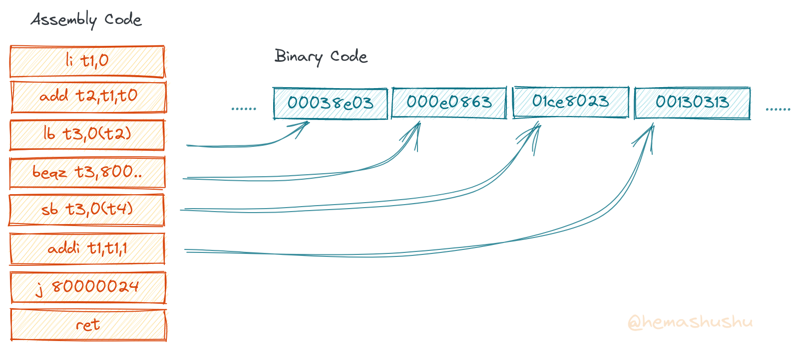
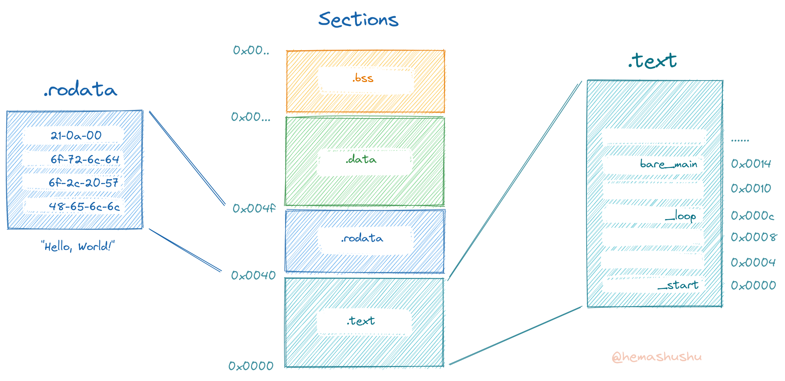

在[上一章](../2022-11-06-s01c02-write-a-program-run-alone-without-os)我们制作了一种无需操作系统，无需任何库就可以独自运行的 “裸机程序”，并且程序的所有内容由我们自己写的代码组成。在这一章我们将会分析程序文件本身，看看可执行文件里头究竟包含了哪些内容，然后把 `Hello, World!` 程序减少到几十个字节。

<!-- @import "[TOC]" {cmd="toc" depthFrom=2 depthTo=6 orderedList=false} -->

<!-- code_chunk_output -->

- [最小的裸机 "Hello, World!" 程序](#最小的裸机-hello-world-程序)
- [汇编语言](#汇编语言)
  - [标签与符号](#标签与符号)
  - [局部标签](#局部标签)
- [汇编（动词）](#汇编动词)
- [链接](#链接)
- [第一次运行](#第一次运行)
- [程序文件里有什么？](#程序文件里有什么)
- [分析可重定位文件](#分析可重定位文件)
  - [文件的 Section](#文件的-section)
  - [查看文件主要段的大小](#查看文件主要段的大小)
  - [目标文件](#目标文件)
    - [文件类型](#文件类型)
  - [查看 ELF 文件的详细信息](#查看-elf-文件的详细信息)
    - [符号列表](#符号列表)
    - [`size`](#size)
    - [`readelf`](#readelf)
    - [`objdump`](#objdump)
    - [段的大小](#段的大小)
  - [反汇编](#反汇编)
  - [链接](#链接-1)
  - [可执行文件](#可执行文件)
    - [文件类型](#文件类型-1)
    - [符号列表](#符号列表-1)
    - [段](#段)
    - [Program Headers](#program-headers)
    - [段大小](#段大小)
  - [第一次运行](#第一次运行-1)
  - [链接脚本](#链接脚本)
  - [第二次运行](#第二次运行)
  - [给程序减肥](#给程序减肥)
  - [第三次运行](#第三次运行)

<!-- /code_chunk_output -->

## 最小的裸机 "Hello, World!" 程序

上一章的 "Hello, World!" 程序为了演示编译过程而被分解为 `startup.S`、`app.c`、`libprint.c` 和 `put_char.S` 等几个源代码文件，实际上它们的代码都非常简单，每个文件的主要内容只有两三句。所以为了简单起见，这章把它们合并到一个汇编文件里。

在任意位置新建一个名为 `minimal` 的目录，然后新建名为 `app.S` 的文件，其内容如下：

```app.S
.equ VIRT_UART0, 0x10000000
.globl _start

.section .text
_start:
    la      sp, stack_top
    call    bare_main

_loop:
    nop
    j       _loop

bare_main:
    la      t0, hello_world     # load hello world string address into t0
    li      t4, VIRT_UART0      # load UART0 address (a immediate number) into t4

    mv      t1, x0              # let t1 = 0 (t1 will be the loop index)
1:
    add     t2, t1, t0          # let t2 = t1 + t0
    lb      t3, 0(t2)           # let t3 = hello_world[t2] (lb = load byte)

    beqz    t3, 2f              # if a0 == 0 then goto `2f`
    sb      t3, 0(t4)           # t4[0] = t3 (sb = store byte)

    addi    t1, t1, 1           # t1 = t1 + 1
    j       1b                  # goto `1b`
2:
    ret

.section .rodata
hello_world:
    .asciz "Hello, World!\n"    # automatic trailing zero
```

> 源代码可以到 [文章的 Github 源代码仓库](https://github.com/hemashushu/hemashushu.github.io/tree/main/src/content/posts) 下载。

代码当中符号 `#` 后面的是注释，我在注释里写了每条指令等效的语句。函数 `bare_main` 的主体是一个循环结构，在每次循环里打印 `hello_world` 字符串的下一个字符，并在遇到字符 `\0` 时跳出循环。

## 汇编语言

汇编源代码经过汇编（这个 _汇编_ 是动词）之后会生成一系列平铺的、无结构的二进制数据，具体来说就是类似 "1011001100000011..." 这样长长的一串二进制数字，为了便于阅读，有时也会以十六进制表示，比如 "b3 03 53 00 ..."。它们实际上是一系列的机器指令（即 _二进制指令序列_），显然人类是很难直接阅读和理解这些二进制数据，所以工程师们发明了使用助记符（文本）来表示这些指令的方法，比如语句 `add t2,t1,t0` 对应的指令是 `0x005303b3`。有了助记符之后，我们就可以使用可阅读理解的文本来书写程序，然后再通过一种程序 ———— _汇编器_ 来将文本转换为二进制指令序列，这些由助记符和数字等语句组成的文本就是 _汇编语言_。


_部分汇编语句对应的二进制指令_

### 标签与符号

二进制指令序列是一种一维的信息，为了方便定位信息，将序列每 8 位（bit）分为一组，即 1 个 _字节_ 作为 1 个单位，然后给每一个字节加上一连串假想的序号，这个序号就是 _地址_，这样一来就可以用地址来定位序列上的每一个数据了。比如地址 `0x0006` 表示第 7 个字节（注意地址是从 0 开始数）。

> RISC-V 架构的每个指令占 4 个字节（即 32 位），压缩指令每个指令占 2 个字节（即 16 位）。也就是说，CPU 每次从指令序列里获取 4 个字节（或者 2 个字节）数据，作为输入的信号，然后让芯片里成千上万个诸如与非门等 "小开关" 噼里啪啦地改变电平（状态），直到所有小开关都安静下来（不再改变电平）之后，就完成一次指令的执行，这样的一次过程所需的时间叫 _一个时钟周期_。CPU 完成执行一个指令之后，又会再次从指令序列里获取数据重复刚才的过程。

虽然使用地址可以定位程序的任意位置，但有时不够直观，于是就有了 _标签_（一个由字符和数字组成的字符串）。我们可以给某些特殊的地址加上标签，比如在上面的程序当中的 `_start`、`_loop`、`bare_main` 以及 `hello_world` 都是标签，通过下面的分析就会知道它们分别表示地址 `0x80000000`、`0x8000000c`、`0x80000014` 和 `0x80000040`。

标签在汇编中有重要的作用：

- 用于构建一个函数。函数是组成程序的基本结构，一个程序可以大致地认为就是一堆函数的结合体（当然除了函数还有数据）。然而指令序列是没有结构的，也不存在函数这个概念，这时就需要 `标签` 来 "模拟" 函数。在汇编里，一个函数由 "一个标签" + "一系列指令" + "一个返回指令" 组成，此时标签的名称就是函数的名称。标签代替了一个函数的地址（即函数首条指令的地址），在书写调用函数的汇编语句时，就不需要知道目标函数的具体地址，只需写目标函数的标签名称即可，汇编器会把标签转换为具体的地址。

- 用于表示全局常量和全局变量。我们知道所谓全局常量（比如字符串）和全局变量就是内存中的一段数据，用 `标签` 可以表示这段数据的位置，此时标签的名称就是全局常量和全局变量的名称。

通常函数、全局常量和全局变量会被外部模块所调用，所以在汇编里会使用 `.globl` 指令导出这些标签，这些导出的标签也叫 `导出符号`，或者简称 `符号`。

### 局部标签

指令序列不但没有函数概念，也没有高级语言里的 _条件语句_ 和 _循环语句_ 等流程控制结构。那么在汇编语言里怎样实现流程控制结构呢？跟函数类似，也是通过 `标签` 和 `跳转指令/条件分支指令` 共同来 "模拟" 的。

例如上面的汇编代码当中的 `beqz t3, 2f`，是一个 _条件分支指令_ 的语句，表示当 `t3` 等于 0 时跳转到标签 `2`。再比如 `j 1b` 是一个 _跳转指令_ 的语句，表示无条件跳转到标签 `1`。

这些由纯数字组成的标签叫 _局部标签_，用于在局部跳转，它们不能导出为符号。使用纯数字作为标签的好处是你不需要为标签命名而犯愁，因为通常它们只是表示一个位置，而没有实际的意义，要给它们命名实在强人所难。

你可能注意到在分支指令或者跳转指令语句里，数字标签后面带有 `f` 或者 `b` 这样的后缀，其中 `f` 表示 `forward`，`b` 表示 `backward`，它们都是表示寻找标签的方向。之所以需要带上寻找方向后缀，是因为局部标签的名称 ———— 数字是允许重复的，在不会发生混淆的情况下，你甚至可以用同一个数字来命名所有局部标签。因为数字允许重复，我们就不需为 "数字排序" 和 "避免数字冲突" 这些琐碎事而烦恼。

> 虽然我们很少会直接书写汇编代码，现代的汇编代码一般是编译程序生成的，不过从汇编语言的一些特性来看，它其实还是挺多 `人性化` 的设计。在这一系列文章里，我们将会设计一门汇编语言，这门汇编语言则是完全的 "书写友好" 和 "阅读友好"，打破传统汇编语言那种 "生人勿近" 的个性。在后面的章节里我会详细介绍这门崭新的汇编语言。

## 汇编（动词）

使用 _汇编器_ 可以将汇编源代码 _汇编_（动词）为 _可重定位文件_，例如：

`$ riscv64-elf-as -g -o app.o app.S`

- 参数 `-g` 用于生成供 GDB 使用的调试信息，调试信息包括源代码当中的局部变量名称，指令对应的源代码的行数等。额外的调试信息会保持在输出文件里面。虽然暂时用不上调试信息，不过在平时编译时都加上可以培养良好的习惯；
- 参数 `-Wall` 用于报告编译过程中的所有警告和错误信息；
- 参数 `-o app.o` 用于指定输出文件的名称。注意 `-o app.o` 是一个整体，而后面的 `app.S` 不属于这个参数的一部分。
- 参数 `app.S` 是汇编源代码文件的名称。

> 因 Linux 发行版的不同，RISC-V GCC 工具链当中的各个工具的名称前缀可能会有所不同，比如 `riscv64-elf-*` 在 Ubuntu 里被命名为 `riscv64-unknown-elf-*`。另外注意区分 `riscv64-elf-*` 和 `riscv64-linux-gnu-*`，前者用于编译和生成 "裸机" 程序，后者用于编译和生成在 Linux 环境中运行的程序。

汇编完成后得到文件 `app.o`。

## 链接

在 [上一章](../2022-11-06-s01c02-write-a-program-run-alone-without-os) 里提到，RISC-V GCC 链接器的默认链接脚本因为程序的加载地址不同，所以不能直接用于生成供 QEMU 运行的裸机程序，这里需要重用上一章的链接脚本 `app.ld`，把该文件复制到当前项目的文件夹 `minimal` 里，然后执行链接命令：

`$ riscv64-elf-ld -T app.ld -nostdlib -o app.out app.o`

链接完成后得到可执行文件 `app.out`。

## 第一次运行

接下来使用 QEMU 的 _全系统模式_ 程序 `qemu-system-riscv64` 来运行上一个步骤生成的 `app.out`：

```bash
$ qemu-system-riscv64 \
    -machine virt \
    -nographic \
    -bios none \
    -kernel app.out
```

如无意外，应该能看到输出一行字符 "Hello, World!"。

> 还记得如何结束 QEMU 程序吗？是快捷键 `Ctrl+a, x` 哦，即先按下 `Ctrl+a`，然后松开 `Ctrl` 键再按 `x` 键。

## 分析可执行文件

现在我们已经知道一个程序是如何构建和产生的，接下来将会进一步了解，作为程序的载体 ———— ELF 文件里面究竟有什么内容，它的内部结构又是怎样的。

GCC Toolchain 包含了一套用于分析 ELF 文件的工具 [GNU Binutils](https://www.gnu.org/software/binutils/) ，使用它可以查看 ELF 文件的结构以及内容。

C 源代码经过编译，或者汇编源代码经过汇编，得到的是 ELF 格式的 _可重定位文件_，然后一个或多个可重定位文件经过链接，则得到 ELF 格式的 _可执行文件_。比如上面的 `app.o` 属于可重定位文件，而 `app.out` 属于可执行文件。Binutils 可以分析这两种类型的文件，不过由于它们的结构和内容都非常相似，而且可重定位文件是中间产物，所以一般没必要检查。下面开始分析可执行文件 `app.out`。

> GNU 汇编器 `as`（即 _GAS_）和链接器 `ld` 虽然跟编译任务关系密切，不过它们不是 GCC 的一部分，而是 Binutils 这套工具的。

## 可执行文件里有什么？

ELF 文件内部是由多个称为 _Section_（`段`）的区块组成的，每个 section 包含一个名字和一段二进制数据。ELF 使用 section 存储不同类型的信息。

让我们回想一下一个普通的应用程序包含有哪些类型的信息：

1. 最主要当然是程序源代码当中的语句，这些语句会被编译或者汇编为二进制指令序列，二进制指令序列会储存在名为 `.text` 的 section 里（section 的名称以点号开始）；
2. 其次是程序源代码当中的数据，数据可以大致分为以下三种类型：
   a. 常量。
      比如字符串和数组常量，这类数据在程序的运行过程中是不会改变的，这类数据储存在名为 `.rodata` 的 section 里，其中 "ro" 是 "read only" 的简写；
   b. 全局变量，包括静态变量。
      这类数据的生命周期贯穿程序的整个运行过程，而且其内容是可以改变的，这类数据存储在名为 `.data` 的 section 里；
   c. 未初始化的全局变量，或者初始值为 0 的全局变量。
      常见于程序中用作缓冲（buffer）的数组，因为其中的内容是在运行过程中由具体的语句填充或者更改，所以在定义的时候一般只会指定缓冲的大小，这类数据存储在名为 `.bss` 的 section 里，其中 "bss" 是 "block starting symbol" 的简写。需要注意的是在程序文件里，`.bss` 段并不占用空间，因为它们没有初始值（或者都是 0），所以在文件里只记录了该段的长度，而没有实际的内容。

一个典型的可执行文件就是由 `.text`, `.rodata`, `.data`, `.bss` 等 section 组成，简单来说它们分别是指令序列、只读数据、可读写数据、未初始化的数据。当然除了 `.text`，其它段都不是必须的。



在汇编源代码里，通过 `.section` 指令来指定接下来的内容应该存储在哪个段里。比如上面的示例里的 `.section .text` 语句，其作用就是告诉汇编器：接下来的内容要放在 `.text` 段里。

### 查看 section

使用程序 `objdump` 可以查看可执行文件的各个 section，例如：

`$ riscv64-elf-objdump -h app.out`

输出的部分内容如下：

```text
Sections:
Idx Name          Size      VMA               LMA               File off  Algn
  0 .text         00000040  0000000080000000  0000000080000000  00001000  2**2
                  CONTENTS, ALLOC, LOAD, READONLY, CODE
  1 .rodata       0000000f  0000000080000040  0000000080000040  00001040  2**0
                  CONTENTS, ALLOC, LOAD, READONLY, DATA
  2 .riscv.attributes 00000043  0000000000000000  0000000000000000  0000104f  2**0
                  CONTENTS, READONLY
  3 .debug_line   00000086  0000000000000000  0000000000000000  00001092  2**0
                  CONTENTS, READONLY, DEBUGGING, OCTETS
...
```

输出结果当中的第二列是 section 的名称，第三列 "Size" 是 section（二进制数据）的大小，第六列 "File off" 是该 section 在 ELF 文件当中的开始位置。
`.text`, `.data` 和 `.bss` 是段的名称，`VMA` 和 `LMA` 分别表示虚拟内存地址和加载地址，`ALLOC, LOAD, READONLY, CODE` 等是段的标记，程序加载器会根据该标记来决定处理该段的方式。

比如 `ALLOC` 表示程序加载器需要分配空间给该段，`LOAD` 表示该段需要从文件加载进内存，`READONLY` 表示该段的内容不能被子进程修改，`CODE` 表示该段是可执行代码，`DATA` 表示该段是数据段。完整的标记列表可以参阅 [GDB - section-flag](https://sourceware.org/gdb/onlinedocs/gdb/Files.html)。


### 查看文件主要段的大小

Binutils 当中的 `file` 程序用于查看程序文件当中主要段的大小，例如：

`$ riscv64-linux-gnu-size app.o`

输出结果如下：

```text
   text    data     bss     dec     hex filename
     83       0       0      83      53 app.o
```

输出结果的前 3 列分别表示程序的代码、可读写数据以及未初始化数据的大小。后两列 "dec" 和 "hex" 是前面 3 项内容的大小的总和，单位为字节。"dec" 是数值的十进制表示，"hex" 是数值的十六进制表示。`size` 输出的结果可以认为是一个程序的 _净重_（_Net weight_），也就是说一个程序运行时真正需要的代码和数据。

如果使用 `ls` 命令查看的话，`app.o` 的大小是 4.3 KB，而使用 `size` 查看 `app.o` 的净重是 83 字节，说明 ELF 格式文件本身会占用一定的空间（当然还有很大一部分是调试信息）。

需要注意的是前 3 列的数值是相关 section 的总大小，比如 "text" 并不是指 `.text` section，同样 "data" 并不是指 `.data` section。一般来说 "text" 列既包括了 `.text` section，也包括了 `.rodata` section 等在运行过程中不会更改的信息。另外 "bss" 列表示未初始化的数据的大小，我们知道这些数据仅在程序运行时才在内存里分配空间，在 ELF 文件里它们并不占用任何空间，但后两项统计值里却包含了它们的大小。

> 初一看 `size` 的输出结果很莫名奇妙，或者说似乎没什么用处。不过对于嵌入式开发来说，`size` 输出的结果相当 "实用"，因为嵌入式设备的储存空间（一般是 Flash）以及运行内存（一般是 SRAM）相当小，通常只有十来或者几十 KB，所以 `size` 的统计值可以让你直接知道设备是否有足够的空间装载和运行你的程序，另外因为嵌入设备的储存空间和运行空间一般用十六进制表示，所以最后一列以十六进制的方式表示，也是为了帮你省去进制换算的麻烦。
-


仔细观察上面显示的 `text` 和 `data` 数值，可知编译器在我们写的应用程序里添加了不少的额外的内容，毕竟当前程序只有两条语句，这样的程序不太可能对应着 1000 多个字节的指令，而且文本内容 "Hello, World!\n" 也只有 14 个字节而已。下面会查看编译器都添加了什么内容。

<!--
为了细化管理，每个段又可以细分为多个子段，子段的名字可以随意命名，不过有些是约定俗称的（以后的文章会讲解）。
上面示例程序中的 `.text.entry` 表示 `.text` 段里面的一个叫做 `.entry` 的子段，该名字是我随意起的。
2. 接下来的两句 `.globl` 表示导出两个 _符号_，`.globl` 关键字后面跟着的是标签的名称，下面会讲解。
3. `_start` 是一个标签，标签实质上是一个地址值。

-->

<!--
机器加载和运行程序的过程

为什么需要一个无限循环呢？这需要从机器是如何执行指令序列说起。从处理器的角度来看，机器指令序列是没有函数概念，运行程序的本质是将程序的一条长长的二进制指令序列加载进内存，然后从第一个指令开始执行，执行完一个指令就指向下一个指令，假如程序当中没有跳转指令的话，则会一直执行到最后一个指令。假如最后一个指令后面还有内存空间，则会一直执行到内存的尽头（尽管这些空间里不是有效的指令，只要不出错则处理器仍然会执行）。处理器就像一个蒙着眼睛捂着耳朵的固执司机，只要路和汽油还有，只要没撞上障碍物，他就一直驱使着车前进。

显然从处理器或者指令序列的角度来看，结构之间、函数之间根本没有边界。所以我们需要约定：一个函数以某个地址开始，这个地址需要加上标签（一般标签名就是函数名），然后以一个返回指令（`ret` 指令）以此表示函数结束。

然后回过头来看函数 `_start`，它的工作是调用另一个函数 `_print_a`，调用完毕之后，程序的所有任务就全部完成了。不过 `_start` 函数是程序的入口，是一切的开端，显然它没有调用者，所以我们没法在该函数的工作完成之后使用 `ret` 指令返回。为了防止处理器在执行完 `_start` 函数之后继续往下执行，只好在函数的末尾处设了一个无限循环，让处理器在这里原地打转（虽然这个方法似乎不怎么优雅）。 -->


### 目标文件

下面检查目标文件的一些基本信息。

#### 文件类型

先检查文件类型：

`$ file app.o`

输出内容如下：

```text
app.o: ELF 64-bit LSB relocatable, UCB RISC-V, double-float ABI, version 1 (SYSV), with debug_info, not stripped
```

可见汇编器输出的是一个 ELF 格式的 _可重定位文件_，也就是平常说的 _目标文件_，它还不是可执行文件。有关 ELF 格式的 3 中类型，可以参阅上一篇文章 [RISC-V GCC 基础](../risc-v-gcc-base/README.zh-Hans.md)。


#### 符号列表

正如前面章节所述，汇编代码里会有表示地址的标签，这些标签经过 `.globl` 导出，就形成可以供外部查看的 `符号`（不过并非所有符号都是标签），可以粗略地把符号理解为函数名称或者全局变量名称。

使用工具 `riscv64-elf-nm` 可以查看目标文件的导出符号列表：

`$ riscv64-elf-nm app.o`

输出的内容如下：

```text
0000000000000008 t _loop
0000000000000010 T _print_a
0000000000000000 T _start
```

左边一列是各个符号的虚拟地址，右边一列是符号的名称，中间一列是符号类型的代号，部分代号的含义如下：

- A: Global absolute symbol.
- a: Local absolute symbol.
- B: Global bss symbol.
- b: Local bss symbol.
- D: Global data symbol.
- d: Local data symbol.
- T: Global text symbol.
- t: Local text symbol.
- U: Undefined symbol.

符号类型代号当中，大写的表示是导出的（供外部使用的），小写的表示局部的（供内部使用的）。详细的列表可参阅 [GNU Binary Utilities Document](https://sourceware.org/binutils/docs/binutils/index.html) 当中的 [nm](https://sourceware.org/binutils/docs/binutils/nm.html) 一章。

类型 `U` 比较特殊，表示未定义的符号。比如在一个源代码文件里，调用了一个外部函数，那么这个外部函数的名称就是一个未定义的符号。可见这里的 "未定义" 是相对当前源代码文件而言的。

> GCC 工具链里很多程序会提供相似的功能，比如列符号表的程序 `nm app.o`，其实也可以使用 `objdump -t app.o` 列出，还可以使用 `readelf --syms app.o` 列出。后面还会看到更多这样的情况，我们根据自己的喜好和习惯选择即可。

#### `size`


#### `readelf`

工具 `readelf` 一般用于查看 ELF 文件的头信息以及段信息，例如：


> 除了 `riscv64-elf-objdump -h`，也可以使用 `riscv64-elf-readelf -S app.o` 列出目标文件的段信息。

ELF 的段（section）有两个视图：一个是从汇编器和链接器等工具看到的 section 视图（上面看到的都是这种视图），另一个是从程序加载器看到的 segment 视图（也称为 program 视图）。

section 视图在 "section headers" 里列出，segment 视图在 "program headers" 里列出；section 视图跟 section 基本上是一一对应，而 segment 视图则跟 section 存在一对多的映射关系，比如 `.text` 和 `.data` 段常常对被映射到同一个 segment。

`$ riscv64-linux-gnu-readelf -l app.out`

参数 `-l` 表示查看程序段信息，输出的（部分）结果如下：

```text
Elf file type is DYN (Position-Independent Executable file)
Entry point 0x5b0
There are 10 program headers, starting at offset 64

Program Headers:
  Type           Offset             VirtAddr           PhysAddr
                 FileSiz            MemSiz              Flags  Align
  LOAD           0x0000000000000000 0x0000000000000000 0x0000000000000000
                 0x00000000000006e4 0x00000000000006e4  R E    0x1000
  LOAD           0x0000000000000e08 0x0000000000001e08 0x0000000000001e08
                 0x0000000000000248 0x0000000000000250  RW     0x1000

 Section to Segment mapping:
  Segment Sections...
   03     .interp .note.gnu.build-id .note.ABI-tag .gnu.hash .dynsym .dynstr .gnu.version .gnu.version_r .rela.dyn .rela.plt .plt .text .rodata .eh_frame_hdr .eh_frame
   04     .preinit_array .init_array .fini_array .dynamic .data .got .bss
```

下面简单讲解上面的内容：

- `LOAD` 表示将会被加载进内存的 segment（因为 `segment` 和 `section` 在中文里都叫作 `段`，所以这里直接使用英文名称。一般情况下 `段` 是指 `section`），下方的 `Section to Segment mapping` 列举了每个 segment 由哪些 section 组成。

   ELF 文件的主要内容由多个段（section）组成，这些段可以形成两个视图：从程序加载器的角度看，有一个叫 `segments` 的视图；从编译器、链接器角度看有一个叫 `sections` 的视图。

- `LOAD` 项目显示了 segment 的文件偏移地址、虚拟地址、物理地址、在文件中的大小、在内存中的大小、标记等信息（这些内容会在本项目的其它文章种讲解）。这些信息会决定程序加载器如何处理 segment，比如 `RE` 标记表示这段内容在内存中具有 "read, execute" 权限，`RW` 标记表示这段内容在内存中具有 "read, write" 权限。

> 在现代的 CPU 内存管理单元里，物理内存被虚拟化，并以固定的大小（比如 4KB）划分为一个个区块（叫作 _页面_），每个内存页面都可以有不同的权限，比如有些内存页面只可读、有些可读写、有些可执行。

- `Entry point 0x5b0` 表示程序的入口，即程序第一个会被执行的指令，位于地址 `0x5b0`，。


使用命令 `riscv64-elf-readelf -l app.o` 即可列出 "program headers"，不过由于目前的 `app.o` 还不是可执行文件，所以它的 "program headers" 是空的。完整的 ELF 文件的结构信息可以参阅 [ELF Format wiki](https://en.wikipedia.org/wiki/Executable_and_Linkable_Format)。


#### `objdump`

工具 `objdump` 可以反汇编可执行文件当中的代码段，查看位置 `0x5b0` 的内容：

`$ riscv64-linux-gnu-objdump -d app.out`

输出（部分）结果如下：

```text
Disassembly of section .text:

...
00000000000005b0 <_start>:
 5b0:   022000ef                jal     ra,5d2 <load_gp>
 5b4:   87aa                    mv      a5,a0
 5b6:   00002517                auipc   a0,0x2
 5ba:   a8253503                ld      a0,-1406(a0) # 2038 <_GLOBAL_OFFSET_TABLE_+0x10>
 5be:   6582                    ld      a1,0(sp)
 5c0:   0030                    addi    a2,sp,8
 5c2:   ff017113                andi    sp,sp,-16
 5c6:   4681                    li      a3,0
 5c8:   4701                    li      a4,0
 5ca:   880a                    mv      a6,sp
 5cc:   fc5ff0ef                jal     ra,590 <__libc_start_main@plt>
 5d0:   9002                    ebreak
```

看到这里你可能感到很惊讶，原来程序的入口（即最先开始执行的指令）并不是 `main` 函数，而是一个名为 `_start` 的过程（大部分 C 语言的教科书或者教程都跟我们说：程序的入口是 `main` 函数，这是一个善意的谎言）。`_start` 过程会做一系列的初始化工作，然后才会调用 `main` 函数，在 `main` 函数执行完毕之后，它还会做一些清理工作。

在上一个输出的结果里往下翻，就可以找到函数 `main` 的内容：

```text
0000000000000668 <main>:
 668:   1141                    addi    sp,sp,-16
 66a:   e406                    sd      ra,8(sp)
 66c:   e022                    sd      s0,0(sp)
 66e:   0800                    addi    s0,sp,16
 670:   00000517                auipc   a0,0x0
 674:   02050513                addi    a0,a0,32 # 690 <_IO_stdin_used+0x8>
 678:   f29ff0ef                jal     ra,5a0 <puts@plt>
 67c:   0001                    nop
 67e:   60a2                    ld      ra,8(sp)
 680:   6402                    ld      s0,0(sp)
 682:   0141                    addi    sp,sp,16
 684:   8082                    ret
```

该段指令包含了普通函数的 _开场白_ 和 _收场白_ 模板代码，以及一句对函数 `puts` 的调用。

#### 段的大小

使用 `riscv64-elf-size` 可以查看各个段的大小：

`$ riscv64-elf-size app.o`

输出的结果如下：

```text
   text    data     bss     dec     hex filename
     32       0       0      32      20 app.o
```

### 反汇编

你可能会疑问，我们刚刚进行了汇编，为什么还要反汇编？反汇编的结果不就是我们手写的汇编代码吗？

是的，对目标文件进行 _反汇编_ 将会得到汇编代码，不过经过反汇编得出的汇编代码跟我们手写的不完全一样，那是因为手写的汇编代码有一部分是 `伪指令`（即由多个真实指令组成的虚拟指令），通过反汇编能得到真实的指令；另外还有一部分是汇编指令，也就是针对汇编器的指令，这部分指令可能会改变汇编的行为，也可能会产生相当多的数据。

再者反汇编工具一般还会显示各个指令的地址，这有帮助我们分析和调试程序。

`$ riscv64-elf-objdump -d app.o`

输出的结果如下：

```text
Disassembly of section .text:

0000000000000000 <_start>:
   0:   00000097                auipc   ra,0x0
   4:   000080e7                jalr    ra # 0 <_start>

0000000000000008 <_loop>:
   8:   00000013                nop
   c:   ffdff06f                j       8 <_loop>

0000000000000010 <_print_a>:
  10:   100004b7                lui     s1,0x10000
  14:   04100913                li      s2,65
  18:   01248023                sb      s2,0(s1) # 10000000 <_print_a+0xffffff0>
  1c:   00008067                ret
```

注意参数 `-d` 仅反汇编 `.text` 段，如果你想查看所有段的内容，可以使用 `-D` 参数代替 `-d`，不过一般不用关心其它段的内容。

下面分析其中的第 2 个指令 `0000_80e7`：

```text
000000000000  00001 000 00001 1100111
____________  _____     _____ _______
|offset[11:0] rs=1      rd=1  jalr
```

解码得出：`jalr ra, 0(ra)`，结合上一条指令 `auipc ra,0x0` 来看，这两条指令并不能实现跳转到 `_print_a` 函数，所以这里的 `0` 是一个占位符。这时 GCC 编译器，也是目前大部分编译器的原理，即在编译阶段，所有涉及函数地址、全局变量地址的地方，都用 `0` 代替，同时会做一张需要重定位的符号列表。仅在链接阶段，才会把真实的地址填上。（具体步骤和原理在后续的文章里会讲解）

### 链接

由上一节可知，因为目标文件当中的所有符号的地址都是用 `0` 顶替的，所以 _目标文件_ 是没法运行的，还需要把符号的真实地址填上，应用程序才能运行，而这这正是链接器的工作。

链接器还有另外一项工作，就是如果存在多个 _目标文件_，那么它还需要把这些文件合并在一起。那么它是怎样合并的呢？

我们知道目标文件里存在多个 “段”，在合并时默认会将相同名称的段合并成一个段。比如假设现有两个目标文件 `a.o` 和 `b.o`。在链接时，`a.o` 的 `.text` 段将会和 `b.o` 的 `.text` 段合并，`a.o` 的 `.data` 段和 `b.o` 的 `.data` 段合并，最后再将合并后的各个段连接起来。

具体的合并方案是由一个链接器的脚本控制的，这个默认脚本可以通过命令 `$ riscv64-elf-ld --verbose` 查看，脚本的具体含义可以参考 [LD 的文档](https://sourceware.org/binutils/docs/ld/index.html) 当中的 [3 Linker Scripts](https://sourceware.org/binutils/docs/ld/Scripts.html) 一章，这里有一个 [中文翻译版](https://blog.csdn.net/m0_47799526/article/details/108765403) 也可以参考一下。

有时目标文件可能是第三方提供的库，比如 C 的数学库 `/usr/lib/libm.so`，所以链接时又有静态链接和动态链接之分，后续的文章会详细讲解。

下面是链接命令：

`$ riscv64-elf-ld -o app.out app.o`

上面程序运行之后得到文件 `app.out`。

### 可执行文件

链接器的输出结果是一个可执行文件，下面查看可执行文件的信息。

#### 文件类型

使用 `file` 工具查看文件的类型：

`$ file app.out`

输出如下信息：

```text
app.out: ELF 64-bit LSB executable, UCB RISC-V, double-float ABI, version 1 (SYSV), statically linked, with debug_info, not stripped
```

对比之前的 `app.o` 的会发现文件类型已经由 `ELF relocatable` 变成 `ELF executable`。使用 `riscv64-elf-readelf -h` 同样可以查看 ELF 格式的头信息：

```bash
$ riscv64-elf-readelf -h app.o
$ riscv64-elf-readelf -h app.out
```

输出的结果如下：

```text
< Type:                              REL (Relocatable file)
< Entry point address:               0x0
< Start of program headers:          0 (bytes into file)
< Number of program headers:         0

> Type:                              EXEC (Executable file)
> Entry point address:               0x100b0
> Start of program headers:          64 (bytes into file)
> Number of program headers:         2
```

#### 符号列表

然后再看看导出符号表：

`$ riscv64-elf-nm app.out`

输出的内容如下：

```text
00000000000110d0 T __BSS_END__
00000000000110cc T __bss_start
00000000000110cc T __DATA_BEGIN__
00000000000110cc T _edata
00000000000110d0 T _end
00000000000118cc A __global_pointer$
00000000000100b4 t _loop
00000000000100bc T _print_a
00000000000110cc T __SDATA_BEGIN__
00000000000100b0 T _start
```

发现多出了几个符号，比如 `__DATA_BEGIN`，`__bss_start` 等，这些符号来自链接脚本。

#### 段

然后再看段信息：

`$ riscv64-elf-objdump -h app.out`

输出的内容如下：

```text
Idx Name          Size      VMA               LMA               File off  Algn
  0 .text         0000001c  00000000000100b0  00000000000100b0  000000b0  2**2
                  CONTENTS, ALLOC, LOAD, READONLY, CODE
```

发现 `.data` 和 `.bss` 段不见了，那是因为它们原本就是无内容的，长度为 0，所以在最后输出文件里被 "优化"（即被移除）了。

`.text` 的长度不变，而 `VMA` （虚拟内存地址）和 `LMA` （加载内存地址）的值都变为 `0x1_00b0`。

#### Program Headers

因为 `app.out` 已经是可执行文件，所以现在可以查看 "program headers" 了：

`$ riscv64-elf-readelf -l app.out`

输出的结果如下：

```text
Elf file type is EXEC (Executable file)
Entry point 0x100b0
There are 2 program headers, starting at offset 64

Program Headers:
  Type           Offset             VirtAddr           PhysAddr
                 FileSiz            MemSiz              Flags  Align
  RISCV_ATTRIBUT 0x00000000000000cc 0x0000000000000000 0x0000000000000000
                 0x0000000000000043 0x0000000000000000  R      0x1
  LOAD           0x0000000000000000 0x0000000000010000 0x0000000000010000
                 0x00000000000000cc 0x00000000000000cc  R E    0x1000

 Section to Segment mapping:
  Segment Sections...
   00     .riscv.attributes
   01     .text
```

"program headers" 主要用于指示程序加载器如何加载程序（到内存），由上面的结果可见程序会被加载到 `0x1_0000`，总共加载 `0xcc` 个字节。又因为程序的入口位于地址 `0x1_00b0`，所以实际指令的大小为 `0xcc - 0xb0 = 0x1c`，这个大小跟 "section headers" 列出的 `.text` 段的大小是一致的。

#### 段大小

然后再次查看各个段的大小：

`$ riscv64-elf-size app.out`

输出的内容如下：

```text
   text    data     bss     dec     hex filename
     28       0       0      28      1c app.out
```

对比链接之前的 `app.o`，发现代码段（即 `.text`）居然减少了 4 个字节，下面通过反汇编便知道其中的原因：

`$ riscv64-elf-objdump -d app.out`

输出的结果如下：

```text
Disassembly of section .text:

00000000000100b0 <_start>:
   100b0:       00c000ef                jal     ra,100bc <_print_a>

00000000000100b4 <_loop>:
   100b4:       00000013                nop
   100b8:       ffdff06f                j       100b4 <_loop>

00000000000100bc <_print_a>:
   100bc:       100004b7                lui     s1,0x10000
   100c0:       04100913                li      s2,65
   100c4:       01248023                sb      s2,0(s1) # 10000000 <__global_pointer$+0xffee734>
   100c8:       00008067                ret
```

从反汇编的结果发现两处不同：

1. 指令的地址从 0x1_00b0 开始（原先从 0 开始）；
2. `call _print_a` 语句由 2 个指令 `auipc` 和 `jalr` 转换为 1 个指令 `jal`，且目标地址被填上真实的地址，RISC-V 一条指令（不管是 32 位还是 64 位）的长度为 4 个字节，所以少了一条指令刚好就少了 4 个字节。

现在分析指令 `00c000ef`：

```text

0    0000000110 0    00000000 00001 1101111
---- ---------- ---- -------- ----- -------
[20] [10:1]     [11] [19:12]  rd=1  jal

```

解码得出：`jal ra, 0b1100`，其中 `0b1100` 是地址偏移值，下面来算算它表示的绝对地址：当前指令地址为 `0x1_00b0`，即在运行的时候，`PC` 寄存器的值为 `0x1_00b0`，加上偏移值 `0b1100` 得出 `0x100bc`，这正好是函数 `_print_a` 的地址。

> 在数字电路里寄存器 `PC` 的值主要有 3 个来源：一个是指令被获取（即 fetch）之后，PC 的当前值加上了数值 `4` 之后的数值；另一个是当前的 PC 值加上跳转指令当中的立即数；最后一个是（jalr 指令）当前 PC 值加上跳转指令的立即数，再加上目标寄存器的值。PC 的下一个值会根据指令的不同而由 _复用器_ 采用这 3 个来源当中的一个。对于上面的 `jal` 指令，采用的是第 2 种来源。

### 第一次运行

上一步得到 `app.out` 是一个 ELF 格式的可执行文件，不过如果你当前操作的计算机是 x86（现在一般指 AMD64 或者 x86-64）或者 ARM 架构的，是无法直接执行这个文件的，因为这个可执行文件的目标平台是 RISC-V 架构。河马蜀黍当前的计算机是 x86 架构，直接执行之后出现了如下提示信息：

```text
$ ./app.out
Segmentation fault (core dumped)
```

我不知道在你的计算机上运行之后会出现什么信息，不过很明显 x86 CPU 无法正确理解 RISC-V 的指令，经过一番挣扎之后估计都会以失败告终（比如上面显示的是 _段失败_ 错误）。

下面使用模拟器 QEMU RISC-V 来运行可执行文件 `app.out`，

```bash
$ qemu-system-riscv64 \
    -machine virt \
    -nographic \
    -bios none \
    -kernel app.out
```

这次不会显示 _段失败_ 错误了，但是等了半天都没等到程序结束，也没看到大写字母 “A”，显然应用程序仍然没有被正确执行。

> 按 `Ctrl+a, x`（即先按下 `Ctrl+a`，然后再单独按下 `x` 键）可结束 QEMU，这个组合键我会反复提示，免得你跟第一次退出 VIM 一样手忙脚乱。

通过后续的文章的 GDB 调试可知，QEMU RISC-V virt 会假设内核程序的开始位置在内存的 `0x8000_0000`，而我们的程序被加载到 `0x0001_00b0`，因此程序根本没有被执行。

这里的 `0x8000_0000` 是一个映射地址，并不是说虚拟机真的有这么大的内存（实际上默认 QEMU RISC-V 虚拟机只有 128MB 内存），这个地址被映射到内存 RAM 的开始位置，可以从 [QEMU RISC-V virt 的源代码](https://github.com/qemu/qemu/blob/master/hw/riscv/virt.c) 找到映射关系：

```c
static const MemMapEntry virt_memmap[] = {
    [VIRT_MROM] =         {     0x1000,        0xf000 },
    ...
    [VIRT_UART0] =        { 0x10000000,         0x100 },
    ...
    [VIRT_FLASH] =        { 0x20000000,     0x4000000 },
    ...
    [VIRT_DRAM] =         { 0x80000000,           0x0 },
};
```

> 有关 QEMU RISC-V 的使用及程序调试方法，会在后续的文章中讲解。

### 链接脚本

那么怎样才能把程序加载到指定的位置呢？这时候就需要定制的 _链接脚本_ 了。链接脚本可以让链接器按照我们的需求产生输出文件，当然也就可以指定程序的加载到内存后的位置。

目录 [resources](./resources/) 里有一个链接器脚本文件 `app.lds`，其内容如下：

```text
OUTPUT_ARCH(riscv)
ENTRY(_start)
BASE_ADDRESS = 0x80000000;

SECTIONS
{
  . = BASE_ADDRESS;

  .text : {
    *(.text.entry)
    *(.text .text.*)
  }

  .rodata : {
    *(.rodata .rodata.*)
  }

  .data : {
    *(.sdata .sdata.*)
    *(.data .data.*)
  }

  .bss :{
    *(.sbss .sbss.*)
    *(.bss .bss.*)
  }
}
```

然后在链接时指定链接脚本：

`$ riscv64-elf-ld -T app.lds -o app.out app.o`

其中参数 `-T app.lds` 用于指定链接脚本。

现在得到了新的文件 `app.out`，使用命令 `$ riscv64-elf-objdump -h app.out` 查看段信息，输出内容如下：

```text
Idx Name          Size      VMA               LMA               File off  Algn
  0 .text         0000001c  0000000080000000  0000000080000000  00001000  2**2
                  CONTENTS, ALLOC, LOAD, READONLY, CODE
```

可见代码段 `.text` 的加载地址已经变为 `0x8000_0000`。

再看看 "program headers"：

`$ riscv64-elf-readelf -l app.out`

输出的结果如下：

```text
Elf file type is EXEC (Executable file)
Entry point 0x80000000
There are 2 program headers, starting at offset 64

Program Headers:
  Type           Offset             VirtAddr           PhysAddr
                 FileSiz            MemSiz              Flags  Align
  RISCV_ATTRIBUT 0x000000000000101c 0x0000000000000000 0x0000000000000000
                 0x0000000000000043 0x0000000000000000  R      0x1
  LOAD           0x0000000000001000 0x0000000080000000 0x0000000080000000
                 0x000000000000001c 0x000000000000001c  R E    0x1000

 Section to Segment mapping:
  Segment Sections...
   00     .riscv.attributes
   01     .text
```

从上面的信息可见程序的入口以及虚拟内存地址均为 `0x80000000`，加载的大小为 `0x1c` 字节，刚好就是代码段的大小。


有关链接脚本的具体内容可以参阅 [Linker Scripts](https://sourceware.org/binutils/docs/ld/Scripts.html) 或者 [中文翻译版](https://blog.csdn.net/m0_47799526/article/details/108765403) 。

### 第二次运行

下面执行新生成的可执行文件 `app.out`：

```bash
$ qemu-system-riscv64 \
    -machine virt \
    -nographic \
    -bios none \
    -kernel app.out
```

如无意外，应该可以看到在终端输出大写字母 “A”。再友情提示一下，按 `Ctrl+x, a` 终止 QEMU。

### 给程序减肥

现在纯汇编写的 RISC-V 程序就已经完成了，先看看程序的大小：

`$ ls -lh`

输出的结果如下：

```text
-rw-r--r-- 1 yang yang  311 Oct 21 15:27 app.lds
-rw-r--r-- 1 yang yang 3.2K Oct 21 11:05 app.o
-rwxr-xr-x 1 yang yang 5.6K Oct 21 15:27 app.out
-rw-r--r-- 1 yang yang  442 Oct 21 06:57 app.S
```

发现了吗？可执行文件 `app.out` 居然有 `5.6KB`，它是如此巨大！不是说只有 30 左右字节的吗？下面我们来给程序减减肥吧。

首先需要知道为什么 `app.out` 文件会那么大，明明当前的应用程序非常简单，编译之后的指令序列只有 `0x1c`（即十进制的 `28`） 个字节。那是因为 ELF 文件格式有固定的结构，这些结构会占用一定的空间，另外 ELF 文件里还包含用于程序调试的信息。使用工具 `riscv64-elf-objcopy` 可以把这些信息通通去掉，只剩下跟链接脚本描述一致的二进制数据（也就是说 `.text`，`.rodata` 和 `.data` 等段的信息会被保留）：

`$ riscv64-elf-objcopy -S -O binary app.out app.bin`

参数 `-S` 表示移除所有多余的信息（包括调试信息），`-O binary` 表示输出文件的格式， `app.out` 和 `app.bin` 分别表示输入和输出的文件名。

指令执行完毕之后会产生一个名为 `app.bin` 的文件，下面检查它的大小：

```text
$ ls -l app.bin
-rwxr-xr-x 1 yang yang 28 Oct 21 15:34 app.bin
```

果然只剩下 `28` 个字节，使用 `xxd` 工具可以肉眼查看它的内容：

```text
$ xxd app.bin
00000000: ef00 c000 1300 0000 6ff0 dfff b704 0010  ........o.......
00000010: 1309 1004 2380 2401 6780 0000            ....#.$.g...
```

如果你的记忆好的话，可能会对上面一段数字有一种似曾相识的感觉，它正是上面章节反汇编可执行文件 `app.out` 代码段时的内容，比如开头的 4 个字节 `ef 00 c0 00`，因为磁盘储存采用 _小端序_ 的缘故，我们需要将字节的顺序反转，得到 `00 c0 00 ef`，这正是第一条指令 `jal ra,100bc` 的机器码 `0x00c000ef`。

### 第三次运行

下面尝试用 QEMU 运行它，不过因为 `app.bin` 除了机器指令，其余的所有信息都被移除了，所以需要手动指定程序加载到内存的位置，也就是说再也不能直接把 `app.bin` 作为 `-kernel` 参数传给 QEMU，转而需要使用参数 `-device loader,file=FILENAME,addr=ADDRESS`：

```bash
$ qemu-system-riscv64 \
    -machine virt \
    -nographic \
    -bios none \
    -device loader,file=app.bin,addr=0x80000000
```

如无意外，上面的命令也能输出正确的结果，同样按 `Ctrl+a, x` 退出 QEMU。
